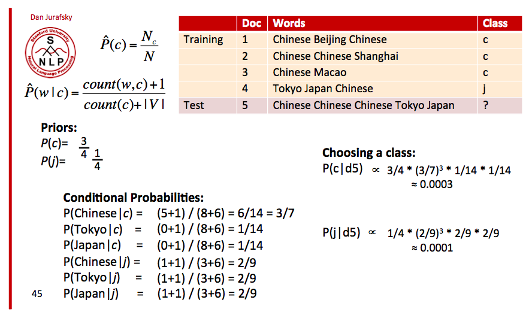
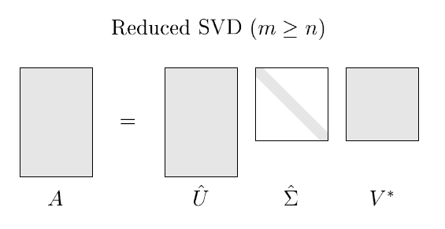

## Model Deep-dive


**Newton-Raphson / Iteratively Reweighted Least Squares (IRLS)**

$$
\beta^{n+1} = \beta^{n} - \bigg( \dfrac{\partial^2 l(\beta)}{\partial \beta \partial \beta^T} \bigg)^{-1} \dfrac{\partial l(\beta)}{\partial \beta}
$$

**Latent-Variable Formulation**

There's no error term in the formulation, but we set one up: $x_i$ has a latent variable $U_i$ that has a logistic distribution that is IID. In Probit Regression, the latent variable $U_i \sim N(0,1)$. Difference between linear and logistic/probit is that we can't estimate latent variables like we can measure the residuals in linear regression.

$$
\begin{aligned}
Y_i &= 1 \text{ if } X_i \beta + U_i > 0 \\
Y_i &= 0 \text{ if } X_i \beta + U_i < 0
\end{aligned}
$$

# Generative Models

## Naive Bayes

All naive Bayes classifiers assume that the value of a particular feature is independent of any other feature, given the class variable. Advantages: very fast; robust to irrelevant features; very good in domains with many equally important features

## Gaussian NB

* calculate mean and standard deviation of each feature for each class
* calculate the probability for each feature using the Gaussian PDF and multiply all probabilities together
* assign label with largest value as prediction

## Multinomial NB

1. calculate priors for each class, $\hat P(c) = \dfrac{N_c}{N}$
2. calculate likelihood of a word occuring in a class (using add 1 smoothing): $\hat P(w | c) = \dfrac{\text{count}(w, c) + 1}{\text{count}(c) + |V|}$, where $V$ is vocabulary size
3. Since the data are proportional, we don't need to divide by $P(\text{document})$



## Gaussian classifier
* = centroid method
* generating model: draw y first, then draw x given y
* GC independence of features in a given class

## Linear Discriminant Analysis
* a generalization of Gaussian classifier for cases where input variables are NOT independent, but all classes have same covariance matrix
* Ridge regression applied to classification is similar to LDA

## Gaussian mixtures
* what if the single cluster per class hypothesis is violated? We can introduce multiple clusters per class (similar to RBF)

# TF-IDF

$$\text{tf-idf}(t, d, D) = \text{tf}(t, d) \cdot \text{idf}(t, D)$$

* Term Frequency: the number of times that term $t$ occurs in document $d$
* Inverse Document Frequency: $\log \bigg( \dfrac{N}{1 + \mid \{d \in D : t \in d \}\mid} \bigg)$
    * Numerator: $N$ = number of docs
    * Denominator: number of documents where the term $t$ appears, adjusted for division-by-zero errors

# KNN

* curse of dimensionality: get more data, make better features, reduce dimensions
* O(N) complexity, infeasible for large datasets
* K-d tree is a binary tree data structure for organizing a set of points in a K-dimensional space
* Hashing by Random Projections

# Distance Measures

**Mahalanobis:** using covar matrix has the effect of decorrelating and normalizing features

$$\mathbf{(x, y \mid \Sigma) = \sqrt{(x-y)\Sigma^{-1}(x-y)}}$$

**Euclidean:** special case of Mahalanobis with the identity matrix $\mathbf{I}$ as the covariance matrix

$$\mathbf{(x, y \mid \Sigma) = \sqrt{(x-y) \cdot (x-y)}}$$

```r
sqrt((x - y) %*% (x - y))
```

**Cosine similarity:** differs from Euclidean in that it doesn't depend on the length of the vectors $\mathbf{x}$ and $\mathbf{y}$. Turned in a distance metric by taking $1- \cos(\theta)$

$$\cos(\theta) = \mathbf{\dfrac{x \cdot y}{\|x\|\|y\|} = \dfrac{x \cdot y}{\sqrt{(x \cdot x)(y \cdot y)}}}$$

```r
x %*% y / sqrt(x%*%x * y%*%y)
```

**Pearson Correlation:**

$$\rho _{X,Y} = \mathbf{\dfrac{(x - \bar x)(y - \bar y)}{\|x - \bar x\|\|y - \bar y \|}} = \dfrac{\sum (x_i - \bar x)(y_i - \bar y)}{\sqrt{\sum (x_i - \bar x)^2} \sqrt{\sum (y_i - \bar y)^2}} = {E[(X-\mu _{X})(Y-\mu _{Y})] \over \sigma _{X}\sigma _{Y}}$$

```r
sum(x_diff*y_diff) / (sqrt(sum(x_diff^2)) * sqrt(sum(y_diff^2)))
# or 
mean(x_diff*y_diff) / (sd(x) * sd(y))
```

## String Distance

**Hamming Distance:** Measures the minimum number of substitutions required to change one string into the other  between two strings of equal length.

**Levenshtein Distance:** Counts the minimum number of operations needed to transform one string into the other, where an operation is defined as an insertion, deletion, or substitution of a single character, or a transposition of two adjacent characters.

**Jacard Similarity:** The size of the intersection of two sample sets divided by the size of the union.

# Decision Tree

Measure best split by:

$$\text{Information Gain = Entropy(parent) – [Weighted Average Entropy(children)]}$$

Entropy is a measure of uncertainty:

$$\text{Entropy} = - \sum^d_{i=1} p_i \log p_i$$

* Stopping criteria: max tree depth, min # of points per node, tree complexity, validation error monitoring
* Pruning can improve performance: prune tree back to where it gives more accurate results on the test data
* Deep trees have high variance (pruning controls this), low bias

# Random Forest
* Averaging: randomize each model
* Bagging (Bootstrap aggregating): randomize the dataset fed to a tree
* More trees reduce variance

# K-means Clustering

Initialize $k$ cluster centers (e.g., by randomly choosing k points among our datapoints). Then we repeatedly:

1. E-step (in EM algorithm): Assign each datapoint to the nearest cluster center (we pretend that we know the cluster centers, and based off this pretense, we guess which cluster each point belongs to)
2. M-step: Update all the cluster centers: for each cluster i, take the mean over all points currently in the cluster, and update cluster center i to be this mean (we do the reverse: we pretend that we know which cluster each point belongs to, and then try to guess the cluster centers)
3. Repeat steps 1 and 2 until cluster assignments stop changing

## Finding K

* [The Elbow Method](https://en.wikipedia.org/wiki/Determining_the_number_of_clusters_in_a_data_set#The_Elbow_Method): looks at the percentage of variance explained as a function of the number of clusters. Choose a number of clusters so that adding another cluster doesn't give much better modeling of the data. Percentage of variance explained is the ratio of the between-group variance to the total variance, also known as an F-test. A slight variation of this method plots the curvature of the within group variance.
* [The Silhouette Method](https://en.wikipedia.org/wiki/Silhouette_(clustering)): measure of how similar an object is to its own cluster (cohesion) compared to other clusters (separation). The silhouette ranges from -1 to 1. Can be calculated with any distance metric, such as the Euclidean distance or the Manhattan distance.
* Gap statistic:

## K-medoids
Cluster centers are exisiting coordinates; can be used with a dissimilarity matrix

## Gaussian Mixture Models

k-means has a hard notion of clustering: point X either belongs to cluster C or it doesn’t. But sometimes we want a soft notion instead: point X belongs to cluster C with probability p (according to a Gaussian kernel). This is exactly like k-means in the EM formulation, except we replace the binary clustering formula with Gaussian kernels.

# Linear Algebra

## Definitions

**Rank:** The rank of $A$ is the number of linearly independent rows in $A$,
which is equal to the number of linearly independent columns in $A$. A matrix is said to have *full rank* if its rank equals the largest possible for a matrix of the same dimensions, which is the min of the number of rows and columns. If $A$ is a square matrix, then $A$ is invertible if and only if $A$ has rank $n$.

**Matrix Inverse:** can only invert a matrix if it is nonsingular square matrix of full rank.s

$$AA^{-1} = A^{-1}A = A$$

**Singular Matrix:** a square matrix that is not invertible; singular if and only if $det(A) = 0$.

**Transpose**

$$
\begin{aligned}
(A^T)^T &= A \\
(AB)^T &= B^TA^T \\
(A + B)^T &= A^T + B^T
\end{aligned}
$$

## Multiplication

**Matrix $\cdot$ Matrix**

$$B = AC \rightarrow b_{ij} = \sum^n_{k=1} a_{ik}c_{kj}$$

**Vector $\cdot$ Vector**

$$
\begin{aligned}
x^T y &= \sum^n_{i=1} x_i y_i \\
\text{Euclidean norm, } \| x \|_2 &= \sqrt{x^Tx} = \bigg( \sum^n_{i=1} \mid x_i \mid^2\bigg)^{1/2} \\
\text{1-norm, } \| x \|_1 &= \sum^n_{i=1} \mid x_i \mid
\end{aligned}
$$

## Moore-Penrose Pseudoinverse

$$A^+ = (A^TA)^{-1}A^T$$

# SVD
$$
\mathbf{\underbrace{X}_{\text{ N } \times \text{ p }} = \underbrace{U}_{\text{ N } \times \text{ p }}\underbrace{\Sigma}_{\text{ p } \times \text{ p }}\underbrace{V^T}_{\text{ p } \times \text{ p }}}
$$



* $\mathbf{U}$ and $\mathbf{V}$ are orthoginal matrices of left- and right-singular vectors along their columns
* $\mathbf{\Sigma}$ is matrix of singular values with diagonal elements $\Sigma_1 \geq \Sigma_2 \geq ... \geq \Sigma_p \geq 0$
* The non-zero singular values of $\mathbf{X}$ are the square roots of the eigenvalues $\mathbf{X^TX}$ and $\mathbf{XX^T}$
* The columns of $\mathbf{U \Sigma}$ are called the principal components of $\mathbf{X}$

# PCA

1. subtract mean from each column of $\mathbf{X}$
2. (sometimes) scale dimentions by its variance
3. compute covariance matrix, $\mathbf{\Sigma = X^TX}$
4. square roots of eigenvalues of $\mathbf{\Lambda}$ are the variance explained by the principal components (eigenvectors)

$$\mathbf{\underbrace{\Sigma}_{\text{ p } \times \text{ p }} = V \Lambda V^T}$$

* $\mathbf{V}$ is an orthogonal matrix composed of eigenvectors of $\mathbf{X}$
* $\mathbf{\Lambda}$ is a diagonal matrix of eigenvalues