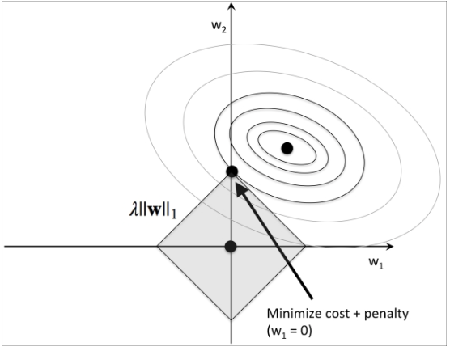

# Machine Learning Concepts

## Gradient Decent

With a cost function that measure the accuracy of our hypothesis, gradient decent is common learning algorithm to find the parameters of hypothesis function based on the best performance of cost function usually local/global optimums. It takes steps proportional to the negative of the gradient (or approximate gradient) of the cost function at the current point.

* batch gradient decent
  * compute gradient use all samples
  * computational expensive or impossible for large dataset (to fit in RAM)
* stochastic gradient decent (SGD)
  * update the weights incrementally for each training sample
  * Easier to converge 
  * faster compute allow more iterations (steps)
  * It can get to global minimum faster than batch GD but it may not get to global minimum but oscillate near it. In most of the cases, this is good enough
* mini-batch SGD
  * most cases for SGD in reality
  * a good balance can help avoid local minimum but find global minimum

## Feature scaling

* Needed for linear model. This is unnecessary for Tree based model
* Features on the same scale to help improve converging
* The cost function contour become skewed if not on the similar scale. And it will take a long time for gradient decent to find global optimum.
* If we would like feature to be normally distributed, we use standard scaler
  * to scale every feature into approximately  $-1 <= x_i <= 1$ range
* Mean normalization
  * Replace $x_i$ with $x_i - \mu$ to make features have approximately zero mean
  * $x_i = \frac{(x_i - \mu)}{\sigma}$
  * Normalization should apply to both training and test dataset, however, the __same__ (training set) mean and standard deviation need to apply to both training and test data
* If we would like data to be maintain its distribution and scale to value between 0 and 1
  * We can also use $range(max - min)$, standard deviation tends to perform better

## Learning Rate

Learning rate determine the speed of model learning and converge.

* Too small, very slow convergence
* Too large, may not converge at all as it bounce around optimums
* **Learning Rate $\alpha$ vs Iteration Plot** 
  * Plot cost function (loss) vs. iteration to determine the right learning rate 
  * Grid search learning, a good rule of them is 3x for non-deep learning model. 

## Bias variance trade-off

* Underfitting (high bias) occurs when an estimator is not flexible enough to capture the underlying trend in the observed data. A machine learning algorithm is too simple with too few features
* Overfitting (high variance) occurs when an estimator is too flexible, allow it to capture the trend in noise in the observation, therefore it does not generalized well. A machine learning algorithm is too complex with too many features but does not generalized well to the new data
* Ideally, we want low variance and low bias

To understand it from statistical point view, we can look at component of estimator using MSE Decomposition:

Mean Squared Error Decomposition: (bias of estimator + variance of estimator + variance of observation noise (irreducible error))

$$
\begin{aligned}
&= \mathbb{E}(Y - \hat Y)^2 \\
&= \text{Var}(Y) + \mathbb{E}\big[ \text{Bias}^2(\hat Y) + \text{Var}(\hat Y) \big] \\
&= \underbrace{\sigma^2}_{\text{irreducible error}} + \text{MSE}(\hat Y)
\end{aligned}
$$

* Variance of the estimator: the average squared difference between any single data points dependent estimates $g(x)$ and the average value of estimated over all dataset.
  * $variance = Var(\hat Y) = \mathbb{E}[(g(x) - \mathbb{E}[g(x)])^2]$
* Bias of the estimator: How an estimator approximate a target function
  * $bias = \mathbb{E}[(g(x)] - f(x)$

### How to detect and diagnose bias and variance trade-off

* Plot learning curve: sample size vs. cost (loss) to determine whether increase sample size has impact on improve model performance of training and validation sets
  * if both training error and validation error is higher than goal => high bias and increase sample size will __NOT__ help
  * if training error is low, test error is high => high variance, increase sample size will help
  * Plot model complexity with cost (loss) and find the min of validation loss curve (*figure 1*)
  
{width=60%}

### How to fix underfitting?

* Increase complexity of the model
* Increase sample size usually has small impacts
  
### How to fix overfitting?

* Increase sample size usually help overfitting because large sample size introduce addition trend and signal of the data for which the model may no longer be too complex
* Reduce the number of features:
  * Select which features to keep with business insight and feature importance analysis
* Regularization
  * Keep all the features, but reduce the magnitude of parameters .
  * Regularization works well when we have a lot of slightly useful features.

### Regularization

* L1 reg (Lasso) $\|W\|$
  * Penalize some feature more than others
  * Sparse Features
  * Reduce model size
  
{width=50%}

* L2 reg (Rridge) $\|W^2\|$
  * Penalize all features
  
{width=50%}

* Elastic net (L1 + L2)
  * Sparse solution, correlated variables grouped, enter/leave the model together

* Step to find best regularization parameter ($\lambda$) (for linear model)
  * Create a list of $\lambda$ values e.g. 0, 0.25, 0.5, 0.75, 1 (higher the $\lambda$, larger the penalty to model complexity) 
  * Create a set of models with different complexity
  * Iterate through the $\lambda$ sets and for each go through all the models to learn.
  * Compute the cross validation error using the learned model and $\lambda$
  * Select the best combo that produces the lowest error on the cross validation set.
  * Using the best combo model and $\lambda$, apply it on test set to see if it has a good generalization of the problem.

## Model Validation

### Randomized Train / Validation / Tets Split (holdout cross validation)

* Split data roughly to 60% / 20% / 20%
* Use training / validation sets to perform train, tuning, evaluation iterations to find the best parameter
* Use test set to perform final evaluation of model generalization a single time
* Cons:
  * Model is sensitive to data partition, e.g. randomized split may not always the best. Use time based split if seasonalities are important features

### K-fold cross validation

* Randomly split training dataset into k folds without replacement where k-1 folds are used for training and one fold is used for testing
* repeat k times to generate k models for performance estimate
* Calculate average performance k models
* less sensitive to sub-partition of data compare to holdout cross validation
* since it is resampling without replacement, the method yields low-variance estimate compare to holdout cross validation
* Typical value is k is 5 or 10, if dataset is small, use larger k value
* If dataset is very small, we can also use leave-one-out cross-validation where k = sample size
* Stratified k-fold means we maintain the class proportion of each fold

### Time-based split

* If time stamp is an important feature and seasonality is an import of insight of the problem, we should use time based data split
* e.g. 6 month of training data, use the first 4 months as training, next 6 weeks as validation and final 3 weeks as hold-out 
* This approach often gives more realistic model performance and generalization of future data

### How to check whether my validation set is representative?

* build multiple models for the training data
* plot score on validation (x) vs test (y) set, am I getting a linear straight line?
  * Train model and score on validation set
  * Retrain model with training + validation set and score on test set

### How to check whether my model can really generalize?

* Random sample test sets
* Create a second test set (store it away), only use it at the end of project

## Model Assessment Metrics

### Classification (Binary)

**Confusion Matrix**

| | Actual Positive | Actual Negative
| --: | :--: | :--:
| Predict Positive| TP | FP
| Predict Negative| FN | TN |

**Accuracy** = overall accuracy of the prediction or 1 - prediction error$$\frac{TP + TN} {\text{Total samples}} = 1 - ERR$$
  * Cons: Can be very misleading when have very imbalanced class

**Precision**: ability of the classifier not to mislabel as positive a sample that is actually negative: $$\frac{TP} {TP+FP} = P(\text{predict positive} \mid \text{label positive})$$

**Recall (Sensitivity, True Positive Rate)**: ability of the classifier to find all the true positive samples: $$\frac{TP} {TP+FN} = P(\text{predict positive} \mid \text{true positive})$$

**Specificity (True Negative Rate)**: ability of the classifier to find the all the negative samples: $$\frac{TN} {TN + FP} = P(\text{predict positive} \mid \text{really negative})$$

{height=40%}

**F1 Score**: weighted harmonic mean, a conservative average and it is often used when the class are balanced $$F _1 = 2 \frac{PR}{P + R}$$

  * Cons: treat precision and recall equally. Does not consider True negative

**ROC Curve: (AUC area under curve)** rates performance of binary classifier system; false positive rate (x-axis) vs. true positive rate (y-axis); 
- Pros: show the full range of probability threshold
- Cons: Focus positive class

**AUCPR** the metric for imbalanced binary classification problem

### Regression

**Mean Squared Error (MSE):** measure of estimation error for regression.

**Root Mean Squared Error (RMSE):** measure of estimation error for regression.

**Coefficient of determination** $R^2$: the proportion of the variance in the dependent variable that is predictable from the independent variable(s). Measure of goodness of fit of linear model. The fraction (between 0 and 1). Intuitively, $R^2$ tells how good is the model vs if you simply use mean as prediction and how well model explain variance
 of MSE the model eliminates.

$$R^2 = \dfrac{\text{var}(X \hat \beta)}{\text{var}(Y)} = 1 - \dfrac{\sum_i (y_i - f_i)^2}{ \sum_i (y_i-\bar{y})^2 }$$

* If $R^2 = 0$, we predict mean
* If $R^2 = 1$, we predict perfectly
* If $R^2 < 0$, we predict worst than mean
* $RMSE$ is the square root of the variance of the residual, it indicate the absolute fit of the model to data. Prediction vs Actual. $R^2$ is a relative measure of fit, how good is the model fit compare to just use the mean to predict

## Deal with Class Imbalance (Binary classification)

* If minority class < 10% of total sample size, we may face class imbalance problem 
* Machine learning algorithm tends to favor majority class
* How to resolve?
  * Upsample minority class or downsample majority class (Upsampling tends to perform better) for training set
  * Do **NOT** balance validation and test set, they should represent the true data distribution of unseen data
  * Use proper metrics: confusion matrix, recall, precision, specificity based on business problems

## Missing Data

* To understand where those missing data come from and why
  * Bad data pipeline, poor data quality?
  * Cannot be measured data?
  * purposely removed?
* How to deal with?
  * If the miss data is very small, ignore the entire observation
  * If the miss data numeric and in small number, impute to median
  * If the number of miss data is significant, create a binary indicator variable to indicate whether data is missing or not
  * For tree based algorithm, impute missing values on numeric variables with missed values with an arbitrary value (such as -9999) because tree based model can learn a split between the arbitrary
  * Most of tree base method such as XGboost tree can handle missing value.
  * segment model based on data availability

## Outliers / Extreme Values

* To understand nature of the outliers and gain business insights
  * Is there an error in the data?
  * Is this a rare or extreme event?
* Tree based algorithm is immune to outliers
* If use linear model, Use MSE as a robust metric to handle outlier observations impacts
* Remove outliers if those observation is rare events and not needed for model generalization
* Apply data transformation to very skewed data.
  * log, sqrt
  * change to categorical data using bins

## Categorical Data

* If cardinality is small (< 10), use one-hot encoding
* If cardinality is large, dummy coding may cause overfitting since it adds many extra columns
  * Manually create bins based on business logic/insights
  * Mean target encoder 
    * replace categorical variable with the mean of the target (%class 1 within the samples of thecategory)
    * encode from training data and apply to validation/test set. If a category in validation/test set but does not exist in training set, set it to N/A
  * Weight of evidence encoder (Bayesian statistics)
  
    $$WOE_{ja} = ln\frac{P(X_j = a|Y = 1)}{P(Xj=a|Y=0)}$$
  
[REF: python category encoder library](http://contrib.scikit-learn.org/category_encoders/index.html)

## How to detect target leakage

* A feature dominate feature importance or the only important feature > 98%, i.e a feature show extreme strong predictability

## Prioritize your work (Recommended approach by Andrew Ng)

* Non-skewed data
  * Start with a simple algorithm, implement it quickly, and test it early on your cross validation data.
  * Plot learning curves to decide if more data, more features, etc. are likely to help.
  * Manually examine the errors on examples in the cross validation set and try to spot a trend where most of the errors were made.
  * It is very important to get error results as a single, numerical metric value. Otherwise it is difficult to assess your algorithm's performance
* Skewed data
  * Measure with precision and Recall or just use confusion matrix 
  * Use F-score (F1 score) as single numeric measure for performance only if you don't care of True Negative
* When does large data set help
  * First look at the feature set, ask if a domain experts can make good prediction with this set of features
    * If not, even with a lot of data, it will improve performance
    * We need enrich the features
    * Large data with low bias algorithm do not help high-bias problem
  * If we have a rich feature set, more data will help
    * We can use low bias algorithm (such as XGBoost or NN) to fit better 
    * but we may face overfitting, therefore formulate a regularization strategy

## Data Drift

There are three main types of change to worry about in machine learning:

1. **Concept drift**

  * The statistical properties of the _target variable_ change
  * Example: a new fraud strategy you haven't seen in the past

2. **Data drift**

  * The statistical properties of the _input variables_ change
  * Example: seasonality of the data or changes in personal preferences

3. **Upstream data changes**

  * Encoding of features change or missing values
  * Example: Fahrenheit is now encoded as Celsius
  * Delta Expectations help handle these upstream changes
  
Additional detail could be added by distinguishing between label, prediction, and concept drift depending on whether the source of drift is the probability distribution of the true label, the model’s predictions, or unaccounted for outside factors. In practice, however, these different sources of drift often demand similar responses.

There are two basic categories of solutions...

* The first adapts the learner regardless of whether drift has occurred
  * This solution would include some notion of memory
  * Filtering for a certain time window (e.g. all data from the past week)
  * Using weighted examples (e.g. this month's data is weighted twice as important as last month's)
  * The main challenge with this option is choosing the best window or filtering method
* Without the ability to actively detect drift, it somewhat arbitrarily selects that threshold

The second solution adapts the learner when it detects drift...

* An adaptive solution is ideal since it can detect the optimal time for retraining
* Will make more data available to the learner, improving model performance

There are a number of statistical methods applicable to drift detection. Create time windows over your data and compute the following basic statistics:

* Mean
* Min
* Max
* Variance
* Percent missing values

For more rigorous comparisons, consider the following methods:

* Numerical features: two-sample Kolmogorov-Smirnov (KS), Mann-Whitney, or Wilcoxon tests.
  * Note: do a check of normalcy and choose the appropriate test based on this (e.g. Mann-Whitney is more permissive of skew) 
* Categorical features: Chi-squared test
* Pearson coefficient to show correlation changes between features and target

### Basic Retraining Solution

Basic solutions to the issue of drift can include the following:

 * Retrain the model periodically on all new and historical data
 * Retrain the model on a known window of data (e.g. the last week of data)
 * Retrain the model while weighing more recent data more strongly
 
The naive implementation of this might look for a 10% slip in error before raising an alarm. A more rigorous approach would look to quantify the shift in context. These approaches often look at the confidence intervals for a given outcome such as the label. When a threshold is reached, it is said that the data is originating from a new context

package: [`skmultiflow`](https://scikit-multiflow.readthedocs.io/en/stable/user-guide/core-concepts.html)