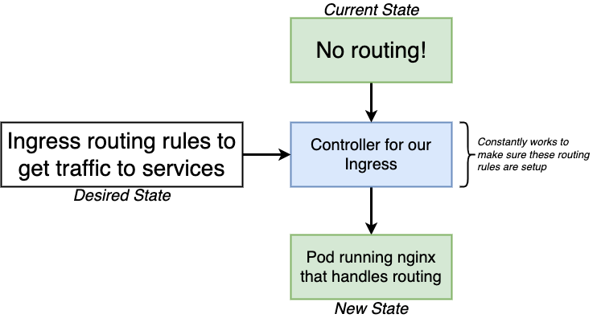

# Kubernetes Notes

## What and Why?

* What: it is a system for running many different containers over multiple different machines
* Why: when we need to run many different containers with different images and when we need to auto scale efficiently


## K8 Architecture


* The API server acts as the front-end for kubernetes. The users, management devices, Command line interfaces all talk to the API server to interact with the kubernetes cluster.
* ETCD is a distributed reliable key-value store used by kubernetes to store all data used to manage the cluster
* The scheduler is responsible for distributing work or containers across multiple nodes
* The controllers are the brain behind orchestration. They are responsible for noticing and responding when nodes, containers or endpoints goes down. The controllers makes decisions to bring up new containers in such cases.
* The container runtime is the underlying software that is used to run containers. People use docker mostly 
* kubelet is the agent that runs on each node in the cluster
* kube proxy takes care of networking within Kubernetes.


### Nodes, Cluster, Pods

* A node is a worker machine and this is where containers are hosted and a node is a virutal machine running on a computer or a server
* A cluster is a set of nodes grouped together. This way even if one node fails you have your application still accessible from the other nodes
  * A master is a node configured as Master (see previous section) to watch over the other nodes in the clsuter and perform orchastration
* The containers are encapsulated into a Kubernetes object known as PODs. A POD is a single instance of an application. A POD is the smallest object
  * To scale, we create a new pod with a new instances of the same application (**not a new container**)
  * To scale UP you create new PODs and to scale down you delete POD
* A pod is a basic (smallist) object in a node that runs one or more close related containers
  * The purpose of pod is to enable grouping of containers with very similar purpose and has very tight interation
  * We cannot just run a single container without a Pod in k8
  * We can run a singal container in a pod as a smallest object in k8
  * PODs can have 1 pod to 1 container or 1 pods to multiple containers for an application such as helper containers
  * Helpers can also dies since they are part of the same POD. 
  * The two containers can also communicate with each other directly by referring to each other as `localhost` since they share the same network namespace. Plus they can easily share the same storage

#### Container:

* Refers to Docker Notes
* Container does not host OS and it only for certain tasks
* When a task is complete, container exists, i.e. it only exist as long as the process inside is alive
* Container commands are defined in image definition
* There are different ways of specifying the command. Either the command simply as is in a shell form. Or in a JSON array format like this. But remember, when you specify in a JSON array format, the first element in the array should be the executable. In this case the sleep program. Do not specify the command and parameters together like this. The first element should always be an executable

***

## K8 config YAML file

* Always container 4 top level fields/properties:
  * `apiVersion`: . This is the version of the kubernetes API we’re using to create the object
  * `kind`: The kind refers to the type of object we are trying to create (e.g. POD, replicaSet, Deployment, Service)
  * `metadata`: the metadata is data about the object like its name, labels etc in the form of dictionary. We CANNOT add property under metadata. metadata can be used to filter, search, grouping pods
  * `spec`: this where we provide additional information to kubernetes pertaining to that object. This is going to be different for different objects,
* The **`apiVersion`** defines a different set of objects (scope) we can use
  * `apiVersion: v1` can use
    * componentStatus
    * configMap
    * Endpoints
    * Event
    * Namespace
    * Pod
  * `apiVersion: apps/v1` can use
    * ControllerRevision
    * StatefulSet
  * The general step will be to first determine what kind of object to create then refer to the k8 doc to find the `apiVersion`

* The **`kind`** section is used to define object type
  * object types: to service different purposes of running a containers
    * Pod
    * StatefulSet 
    * ReplicaController
    * service


#### Entry point

Unlike Virtual Machines, containers are not meant to host an Operating System. Containers are meant to run a specific task or process. Once the task is complete the container exits. A container only lives as long as the process inside it is alive. By default Docker does not attach a terminal to a container when it is run. And so the bash program does not find a terminal and so it exits. As a result, to perform linux command, we need to use entry point

* Pods definition with entry point and parameter for the container image

  The dockerfile that sleeps for given num of seconds
  * `ENTRYPOINT` in the docker file specify the program that will be run when the container starts
  * `CMD` in the dockerfiles is the default parameter that will be append to the entrypoint
  * `command` in the pod config can overwrite entrypoint (i.e. `ENTRYPOINT`) in the dockerfile
  * `arg` in the pod config overwrites the default parameter (i.e. `CMD` option)

  dockerfile

  ```docker
  FROM Ubuntu

  ENTRYPOINT ["sleep"]

  CMD ["5"]
  ```

  pod definition

  ```yaml
  apiVersion: v1
  kind: Pod
  metadata:
    name: ubuntu-sleeper-pod
  spec:
    containers:
      - name: ubuntu-sleeper
        image: ubuntu-sleeper
        #command: ["sleep2.0"]
        args: [“10”]
  ```

  ```bash
  # to get docker run --name ubuntu-sleeper ubuntu-sleeper 10
  kubectl create -f pod-definition.yaml
  ```

* reference: https://kubernetes.io/docs/tasks/inject-data-application/define-command-argument-container/


#### Environment variables

* Under `spec` section, use `env` property, and define as an array (yaml)

  ```yaml
  apiVersion: v1
  kind: Pod
  metadata: 
    name: simple-webapp-color
  spec: 
    containers:
      - name: simple-webapp-color
        image: simple-webapp-color
        ports: 
        - containerPort: 8080
        env: 
        - name: APP_COLOR
          value: pink
  ```

* env variable can also be `configMaps` or `secretKeys` using `valueFrom` in addition to just define `value`

  ```yaml
  apiVersion: v1
  kind: Pod
  metadata: 
    name: simple-webapp-color
  spec: 
    containers:
      - name: simple-webapp-color
        image: simple-webapp-color
        ports: 
        - containerPort: 8080
        env: 
        - name: APP_COLOR
          valueFrom:
            configMapKeyRef: 
        - name: APP_FONT
          valueFrom:
            secretKeyRef: 
  ```
  
  * ConfigMaps are used to pass configuration data in the form of key value pairs in Kubernetes. When a POD is created, inject the ConfigMap into the POD, so the key value pairs are available as environment variables for the application hosted inside the container

    ```bash
    kubectl create configmap \
        app-config --from-literal=APP_COLOR=blue
                   --from-literal=APP_MOD=prod
    # or
    kubectl create –f configmap.yaml
    ```

    ```yaml
    apiVersion: v1
    kind: ConfigMap
    metadata:
      name: app-config
    data:
      APP_COLOR: blue
      APP_MODE: prod
    ```

    To see defined configmap details

    ```bash
    kubectl get configmaps
    kubectl describe configmaps
    ```

  To add to pod definition, we can also use `envFrom` instead of `valueFrom`

    ```yaml
    apiVersion: v1
    kind: Pod
    metadata:
      name: simple-webapp-color
    spec: 
      containers:
        - name: simple-webapp-color
          image: simple-webapp-color
          ports: 
          - containerPort: 8080
          envFrom: 
          - configMapRef
            name:

    ```

***

## Kubernetes CLI: `kubectl`

### Run kubectl directly

```bash
kubectl run nginx --image nginx
```
This is to deploy a docker container by creating a pod with image of nginx (from publich docker hub usually based on config)

### Feed a config file to kubectl

* `apply` or `create` change the current configuration of our cluster and  `-f` based a config file

    ```bash
    kubectl apply -f <config_filename>
    kubectl create -f <config_filename>
    ```

* `get` command retrive information about a running K8 object

    ```bash
    ❯ kubectl get pods
    NAME         READY   STATUS    RESTARTS   AGE
    client-pod   1/1     Running   0          13s
    ❯ kubectl get services
    NAME               TYPE        CLUSTER-IP     EXTERNAL-IP   PORT(S)          AGE
    client-node-port   NodePort    10.97.58.172   <none>        3050:31515/TCP   18s
    kubernetes         ClusterIP   10.96.0.1      <none>        443/TCP          11d
    ```

  * `port: 3050` allow other pods to talk to the defined pod
  * `nodePort: 31515` get exposed to outside world (for users for URL) (need to be between 30000 - 32767 if not defined, it will randomly selected in between range)
  * We can use `localhost:31515` in a browser to access the service (This approach only work with Docker Desktop but it does not work with minikube)

* `describe`

  ```bash
  kubectl describe pod client-pod
  ```

  shows details about the pods running`

* `edit` we also edit pod container image on the fly using edit command instead of change the yaml file

  ```bash
  kubectl edit pod redis
  ```

* `--dry-run=client` we can generate yaml file automatically

  ```bash
  kubectl run redis --image=redis123 -dry-run=client -o yaml > redis.yaml
  ```

### Use `apply` CLI command

* `kubectl apply` command can manage k8 objects in an declaritive way
* It takes the consideraton of both the local config file and the live k8 objects definitions
  * if the object does not exit, it will first create a json version of local config (as last applied config) in K8 then the object will be be created from the json definition, lastly it will create an live configuration in K8 with additional fields to store the data of the object which is the configuration of the live object on the K8 cluster
  * If the local configuration changes, it will compare all 3 defintion (local config, json config, and K8 config with additional field) to determine what needs to be updated
  * How is the json of last applied version stored? It is stored in the live configuration as one of the metadata annotation field called: `kubectl.kubernetes.io/last-applied-configuration:`
* The above mechanics only exists for the `apply` command for the declaritive approach

#### Imperitive vs declarative

* `Imperative Deployment` : do exactly these steps to arrive at this container setup
* `Declarative Deployment`: our container should look like this, K8 you figure out how to make it happen
* Recommended approach for real production deployment => `Declarative Deployment` which is what Kubernetes is designed for.
* Imperitive commands:
  * `kubectl run`
  * `kubectl create`
  * `kubectl expose`
  * `kubectl update`
  * `kubectl edit`
  * `kubectl scale`
* Declarative commands:
  * `kubectl apply -f myapp.yaml` create object
  * `kubectl apply -f myapp.yaml` update object

***

## Other Important K8 Objects

### Service

* It is to set up networking in K8 cluster
* Service sub types (Defined in `spec`)
  * ClusterIP
  * NodePort: expose a container to the outside world (only good for dev purposes)
    * Kube-proxy connects K8 nodes to outside world
  * LoadBalancer
  * Ingress
* We use selector defines a `label` (e.g. `component`) name that can be recognized by other k8 objects with the `label`
* ports
  * `port: 3050` allow other pods to talk to the defined pod
  * `targetPort: 3000` the port that inside the define pod that we want to open up the traffic to (it is also defined in the pod config)
  * `nodePort: 31515` get exposed to outside world (for users for URL) (need to be between 30000 - 32767 if not defined, it will randomly selected in between range)

### Namespace

* Enable isolution of different functionality, purpose, policies
* Common K8 namespaces:
  * kube-system
  * kube-public
  * default
  * dev
  * prod
* Example:
  * service name: `dbservice`
  * namespace: `dev`
  * service flag: `svc`
  * domain: `cluster.local`
  
  ```bash
  # if within a namespace
  mysql.connect("dbservice") 

  # outside a namespace, need to define name space `dev` in a full path
  mysql.connect("dbservice.dev.svc.cluster.local") 
  
  # get or create pods from default namespace
  kubectl get pods
  kubectl create -ff pod definition.yaml
  
  # get or create pods from a given namespace
  kubectl get pods --namespace=kube-system
  kubectl create -f pod definition.yml --namespace=dev
  ```

* namespace actions

  ```bash
  kubectl get namespaces
  kubectl get pods --namespace=kube-system
  kubectl create -f namspace-definition.yaml
  kubectl create -f pod-definition.yaml --namepsace=my_namespace
  ```

  

***

## Scheduling

### How manual scheduling works

* If no scheduler, pods will be in pending state, it can be maunally assign to a node if the pod is already running using `binding`
* bind pod to node

  ```yaml
  apiVersion: v1
  kind: Binding
  metadata:
    name: nginx
  target:
    apiVersion: v1
    kind: Node
    name: node02
  ```
  
  Convert the yaml to to json

  ```bash
  curl --header "Content-Type:application/json" --request POST --data '{"apiVersion":"v1", "kind": "Binding“ …. } http://$SERVER/api/v1/namespaces/default/pods/$PODNAME/binding/
  ```

### Daemon sets

* Make applications to all nodes for functions such as monitoring, logging
  * kube proxy
  * networking
* Define a yaml file similar to replicaset definition

  ```yaml
  apiVersion: apps/v1
  kind: DaemonSet
  metadata:
    name: monitoring-daemon
  spec:
    selector:
      matchLabels:
        app: monitoring-agent
      template:
        metadata:
          labels:
            apps: monitoring-agent
        spec:
          containers:
          - name: monitoring-agent
            image: monitoring-agent
  ```

  ```bash
  > kubectl create -f daemon_set.yaml
  > kubectl get daemonsets
  > kubectl describe daemonset monitoring-daemon
  ```

### Multiple scheduler

* We can create a custom scheduler with custom conditions for a specific applications
* Default scheduler defined inside `kube-scheduler.service` with `--scheduler-name`
* We define a custom `my-customer-scheduler.service` with `--scheduler-name`
* We can define scheduler as a pod
  * set `--leader-elect`
  * when define a new application pod, define `schedulerName` under spec section
  * `kubectl get event` to see scheduler events


### Label and selectors

* We use label to identify K8 objects and we use selectors to filter and find objects based on condition using labels
* Add label in the metadata label field
* We can use select from CLI or in the spec section of the config file

### Taint and Tolerations

* Taint and toleration is a mechanism K8 set condition for nodes to only accept certain pods

  ```bash
  # kubectl taint nodes node name key= value:taint effect (NoSchedule | PreferNoSchedule | NoExecute)
  > kubectl taint nodes node1 app=myapp:NoSchedule
  ```

* tolerations field is defined in pod yaml file under spec

  ```yaml
  apiVersion :
  kind : Pod
  metadata:
    name: myapp pod
  spec:
    containers:
    - name: nginx container
      image: nginx

    tolerations:
    - key: "mykey"
      operator: “Equal”
      value: "myvalue"
      effect: "NoSchedule
  ```

* find taint `kubectl describe node kubemaster | grep Taint`


### Note Selectors and Affinity

* `nodeSelector` is a field (key value pair) defined under spec of pod definition to select the node with label match the selector (e.g. `size: Large`)
* To label a node using `kubectl`

  ```bash
  kubectl label nodes node-1 size=Large
  ```

* Pod definition with `nodeSelector`
  ```yaml
  apiVersion:
  kind: Pod
  metadata:
    name: myapp-pod
  spec:
    containers:
    - name: data-processor
      image: data-processor
    
    notdeSelecor:
      size: Large
  ```
* `nodeAffnity` allow conditional node selection which is more flexible in selecting the nodes for pods

  ```yaml
  apiVersion:
  kind: Pod
  metadata:
    name: myapp-pod
  spec:
    containers:
    - name: data-processor
      image: data-processor
    
    notdeSelecor:
      size: Large
    
    affinity:
      nodeAffinity:
        requireDuringSchedulingIgnoredDuringExecution
          nodeSelectorTerms:
          - matchExpressions:
            - key: size
              operator: In
              values:
              - Large
  ```

  * Types: based on when the condition needs to be meet
    * requiredDuringSchedulingIgnoredDuringExecution 
    * preferredDuringSchedulingIgnoredDuringExecution
    * (Planned) requiredDuringSchedulingRequiredDuringExecution
  * operatiors: `In`, `Exists`, `NotIn`, `DoesNoteExist`, `Gt`, `Lt`

* We use using Taints/Tolerations and Node Affinity together to ensure the pod to node assignment
  * We use taint/toleration to prevent other pods to put on our desired nodes, we use noe affinity to ensure our pods to be put on our desired nodes


### Static Pods

* Static pods is used to setup service from scratch when there is no master node (scheduler, ESTCD, etc), and we only have kubelet
* We need to provide pod definition files in a directory so the kubelet can periodically read this file and create/update pods
  * Location: `/etc/kubernetes/manifests`  
  * If we update the files, kubelet will auto update, if we remove, kubelet will auto delete those pods
  * The location can be defined as a property in `kubelet.service` or in a config file
    * `--pod-manifest-path=/etc/kubernetes/manifests`
    * `--config=kubeconfig.yaml` and inside with `staticPodPath: /etc/kubernetes/manifest/`

***

## Logging & Monitoring

### Monitor Cluster components

* Using Metrics Server

  ```bash
  git clone https://github.com/kubernetes-incubator/metrics-server.git
  kubectl create –f deploy/1.8+/
  kubectl top node # list out cpu and memory of nodes
  kubectl top pod # list out cpu and memory of pods
  ```

### Logging

* get logs from docker containers in a pod
  * `kubectl logs -f event-pod` `-f` means live stream log
  * `kubectl logs -f event-pod <container_name1>` if there multiple container in the pod

    ```yaml
    apiVersion: v1
    kind: Pod
    metadata:
      name: event-pod
    spec:
      containers:
      - name: <comtainer_name1>
        image: <image1>
      - name: <comtainer_name2>
        image: <image2>
    ```

***

## Application lifecycle management

### Rolling Updates and rollback deployment

* `kubectl rollout status <deployment>/<my_deployment>`
* `kubectl rollout history <deployment>/<my_deployment>`
* Strategies
  * Recreate: destroy all application pods/container and recreate all pods
  * Rolling Update (default): scale down 1 at a time, scale up 1 at a time for replicaset
* To observe, run `kubectl describe deployment`
  * `kubectl get replicaset`
* We can update the `deployment-definition.yaml` and run `kubectl apply -f deployment-definition.yaml`
  * Or run `kubectl set image deployment/myapp-deployment <container_name>=<new version>`
* To check rollout status `kubect rollout status deployment/myapp-deployment`
* To check rollout history `kubect rollout history deployment/myapp-deployment`
* To undo/rollback, run `kubectl rollout undo deployment/myapp-deployment`

### Commands and Arguments

* refer to the entry point above

### Environment variable

* refer to the environment variable section above

### Configmap

* refer to the environment variable section above

  ```yaml
  apiVersion: v1
  kind: ConfigMap
  metadata:
    name: app-config
  data:
    APP_COLOR: blue
    APP_MODE: prod
  ```
  
  ```bash
  kubectl create -f config-map.yaml
  kubectl get configmaps
  kubectl describe configmaps
  ```

### Secrets

* Similar to configmap but stored in an encoded file format
* 2 steps:
  * Create a secret
    * Imperative: `kubectl create secret generic <secret-name> --from-literal=<key>=<value>`
    * Declarative: `kubectl create -f secret-data.yaml`
      * Need to encode the password before add to yaml file

        ```bash
        # encode
        > echo –n ‘mysql’ | base64
        bXlzcWw=
        > echo –n ‘root’ | base64
        cm9vdA==
        > echo –n ‘paswrd’ | base64
        cm9vdA==
        
        # decode
        > echo –n ‘bXlzcWw=’ | base64 --decode
        mysql
        > echo –n ‘cm9vdA==’ | base64 --decode
        root
        > echo –n ‘cm9vdA==’ | base64 --decode
        paswrd
        ```

        ```yaml
        apiVersion: v1
        kind: Secret
        metadata: 
          name: app-secret
        data:
          DB_Host: bXlzcWw
          DB_User: cm9vdA==
          DB_Password: cm9vdA
        ```

  * Inject into a pod
  
  ```yaml
  apiVersion: v1
  kind: Pod
  metadata:
    name: simple webapp color
    labels:
      name: simple webapp color
  spec:
    containers:
    - name: simple webapp color
      image: simple webapp color
      ports:
        - containerPort : 8080
      envFrom:
        - secretRef
            name: app-secret
    ```
  
  * optinal: [encrypting secret data at rest](https://kubernetes.io/docs/tasks/administer-cluster/encrypt-data/)

### Multi Container Pods

* example:

  ```yaml
  apiVersion: v1
  kind: Pod
  metadata:
    name: simple webapp
    labels: 
      name: simple-webapp
  spec:
    containers:
    - name: simple-webapp
      image: simple-webapp
      ports:
        - containerPort : 8080
    - name: log-agent
      image: log-agent
  ```

* There are 3 common patterns, when it comes to designing multi-container PODs. 
  * with the logging service also known as a side car pattern. 
  * The adapter 
  * The ambassador pattern.
* An `initContainer` is configured in a pod like all other containers, except that it is specified inside a `initContainers` section

  ```yaml
  apiVersion: v1
  kind: Pod
  metadata:
    name: myapp-pod
    labels:
      app: myapp
  spec:
    containers:
    - name: myapp-container
      image: busybox:1.28
      command: ['sh', '-c', 'echo The app is running! && sleep 3600']
    initContainers:
    - name: init-myservice
      image: busybox
      command: ['sh', '-c', 'git clone <some-repository-that-will-be-used-by-application> ; done;']
  ```

  * When a POD is first created the initContainer is run, and the process in the initContainer must run to a completion before the real container hosting the application starts
  * can configure multiple such initContainers as well, like how we did for multi-pod container

***

## Cluster Maintenance

### OS upgrade

* Approach:
  * pods are terminated from the node and recreated to other nodes. The nodes are marked unschedulable and recreated until further notice (`uncordon`) to allow performing upgrade

    ```bash
    > kubectl drain node1
    > kubectl uncordon node1
    > kubectl cordon node1 # manually mark the node unschedulable
    ```

### Kubernetes releases

* Different k8 component may have different release versions
* https://kubernetes.io/docs/concepts/overview/kubernetes-api/

* Here is a link to kubernetes documentation if you want to learn more about this topic (You don't need it for the exam though):

  * https://github.com/kubernetes/community/blob/master/contributors/devel/sig-architecture/api-conventions.md

  * https://github.com/kubernetes/community/blob/master/contributors/devel/sig-architecture/api_changes.md

### Cluster upgrade process

* No other component should have higher version than K8 API server except kubectl since the api server is a central piece
* kubectl can be within 1 version higher or lower than k8 api server
* The recommended approach is to upgrade 1 minor version up at a time not go all the way to the newest version
* steps
  * Check how to upgrade

    ```bash
    > kubeadm upgrade plan
    > kubeadm upgrade apply <version>
    ```

  * upgrade kubeadm then kubelet configuration

    ```bash
    > apt-get upgrade -y kubeadm=<version>
    > kubeadm upgrade apply <version>
    > kubectl get nodes # check version>
    > apt-get upgrade -y kubelet=<version>
    > systemctl restart kubelet
    ```

  * drain the nodes first to upgrade for worker notes (Note: `kubectl drain` command needs to be ran on the master node)
  
    ```bash
    # at master node run
    > kubectl drain node1
    
    # at worker node run
    > apt-get upgrade -y kubeadm=<version>
    > apt-get upgrade -y kubeclet=<version>
    > kubeadm upgrade node1 config --kubelet-verion <version>
    > systemctl restart kubelet

    # at master node run
    > kubectl uncordon node1
    ```


### Backup and restore

* Resource configuration
  * ideally we want to use declartive approach and store config in yaml file in github
  * To get config if it is not already saved `kubectl get all all namespaces o yaml all deploy services.yaml`
* ETCD Cluster
  * Need special instructions (see etcdctl reference)
* Persistent Volumes

#### Reference

* https://kubernetes.io/docs/tasks/administer-cluster/configure-upgrade-etcd/#backing-up-an-etcd-cluster
* https://github.com/etcd-io/website/blob/main/content/en/docs/v3.5/op-guide/recovery.md
* https://www.youtube.com/watch?v=qRPNuT080Hk


***

## Security

### Security Primitives

* Secure Hosts
  * Password based authentication disabled
  * Only SSH key based authentication available
* kube-apiserver is the first defence, make 2 types of decisions:
  * Who can access the cluster? (Authorization)
    * Files Username and Passwords
    * Files Username and Tokens
    * Certificates
    * External Authentication providers LDAP
    * Service Accounts
  * What can they do? (Authorization)
    * RBAC Authorization
    * ABAC Authorization
    * Node Authorization
    * Webhook Mode
* All communication between components of kubenetes are using TLS encrytpion thus TLS certificates
* Within a cluster, the communication between pods are managed by network policies

### Authentications
* User types
  * User: adimin or developers
  * bots: service account
  * But kubenetes cannot create users directly
  * kubenetes can only create service account with options:
* All user access is managed by kube-apiserver
* Authentication methods
  * static password file (not recommended)
  * static token file (not recommended)
  * certificates
  * identify services


  Setup basic authentication on Kubernetes (Deprecated in 1.19)
  Note: This is not recommended in a production environment. This is only for learning purposes. Also note that this approach is deprecated in Kubernetes version 1.19 and is no longer available in later releases

  Follow the below instructions to configure basic authentication in a kubeadm setup.

  Create a file with user details locally at /tmp/users/user-details.csv

  ```csv
  # User File Contents
  password123,user1,u0001
  password123,user2,u0002
  password123,user3,u0003
  password123,user4,u0004
  password123,user5,u0005
  ```

  Edit the kube-apiserver static pod configured by kubeadm to pass in the user details. The file is located at /etc/kubernetes/manifests/kube-apiserver.yaml

  ```yaml
  apiVersion: v1
  kind: Pod
  metadata:
    name: kube-apiserver
    namespace: kube-system
  spec:
    containers:
    - command:
      - kube-apiserver
        <content-hidden>
      image: k8s.gcr.io/kube-apiserver-amd64:v1.11.3
      name: kube-apiserver
      volumeMounts:
      - mountPath: /tmp/users
        name: usr-details
        readOnly: true
    volumes:
    - hostPath:
        path: /tmp/users
        type: DirectoryOrCreate
      name: usr-details
  ```

  Modify the kube-apiserver startup options to include the basic-auth file

  ```yaml
  apiVersion: v1
  kind: Pod
  metadata:
    creationTimestamp: null
    name: kube-apiserver
    namespace: kube-system
  spec:
    containers:
    - command:
      - kube-apiserver
      - --authorization-mode=Node,RBAC
        <content-hidden>
      - --basic-auth-file=/tmp/users/user-details.csv
  ```

  Create the necessary roles and role bindings for these users:

  ```yaml
  ---
  kind: Role
  apiVersion: rbac.authorization.k8s.io/v1
  metadata:
    namespace: default
    name: pod-reader
  rules:
  - apiGroups: [""] # "" indicates the core API group
    resources: ["pods"]
    verbs: ["get", "watch", "list"]
  
  ---
# This role binding allows "jane" to read pods in the "default" namespace.
  kind: RoleBinding
  apiVersion: rbac.authorization.k8s.io/v1
  metadata:
    name: read-pods
    namespace: default
  subjects:
  - kind: User
    name: user1 # Name is case sensitive
    apiGroup: rbac.authorization.k8s.io
  roleRef:
    kind: Role #this must be Role or ClusterRole
    name: pod-reader # this must match the name of the Role or ClusterRole you wish to bind to
    apiGroup: rbac.authorization.k8s.io
  ```
  Once created, you may authenticate into the kube-api server using the users credentials

  ```bash
  curl -v -k https://localhost:6443/api/v1/pods -u "user1:password123"
  ```

### TLS certificates (Pre-Req)

* Asymmetric encriptytion (e.g. ssh)
  * private key + public lock (also a key)
    * use ssh as example. id_rsa is private key, id_rsa.pub is public lock where we add the public lock (id_rsa.pub key) to the authorized_key file
  * In a more complex use case
    * User gets a public lock from server
    * User encrypt user's private key with the public lock and send back to server
    * Server use its private key to unlock user's private key with server's privite key since it is locked by its public key
    * Hacker cannot unlock because it cannot get server's private key
    * By using certificate (along with the server's public lock) to validate its identity, the server ensure user cannot be tricked into provide its private key to fake servier (website)
  * certificate require issure signicture to prevent fake certificate (Web brower has certification validation mechnism, and give warning)
  * CA (certificate authority) validate the certificate for web browser
  * PKI (public key infrastructure)
  * certificate (public key) uses `*.crt` or `.pem` extention
  * private key uses `*.key` or `key.pem` has the word `key` in them
  * types:
    * server
    * client
    * root

### TLS in Kubernetes

* To ensure connection between master node and service nodes; user and the nodes are secure
  * server certificate for server
    * apiserver.crt apiserver.key
    * etcdserver.crt etcdserver.key
    * kubelet.crt kubelet.key
  * client certificate for user
    * admin.crt admin.key
    * scheduler.crt scheduler.key
    * controller-manager.crt controller-manager.key
    * kube-proxy.crt kube-proxy.key
    * apiserver-kubelet-client.crt apiserver-kubelet-client.key
    * apiserver-etcd-client.crt apiserver-etcd-client.key
    * apiserver-client.crt apiserver-client.key
  * CA (Certificate Authority)
    * ca.crt ca.key
* Tools to generate certificate (we use openssl)

  generate key example
  ```bash
  # First create CA key
  openssl genrsa -out ca.key 2048 # generate key
  openssl req -new -key ca.key -subj "/CN=KUBERNETES-CA" -out ca.csr # certificate signing request
  openssl x509 -req -in ca.csr -signkey ca.key -out ca.crt # sign certificate
  
  # Create admin key
  openssl genrsa -out admin.key 2048 # generate key
  openssl req -new -key admin.key -subj "/CN=kube-admin/O=system:masters" -out admin.csr # certificate signing request
  openssl x509 -req -in admin.csr -CA ca.crt -CAKey ca.key -out admin.crt # sign certificate
  ```

***
***

## Kubernetes Examples

### Running K8 locally

* kubectl is a command line tool that control the virtual machines (nodes) 
  * Check Onenote clipped article
* minikube is used for local and mainly for testing purpose NOT for production

### K8 vs multi-container Docker Build

* Docker can optionally get docker-compose to build an image <=> K8 expect all images to already be built => Image is already hosted
* Each entry represent a container with docker <=> we need to create 1 config file per object (such as pod/node) => one config file for the container (node)
* Each entry defines the network requirement <=> we need to manully set up the network => one config file for the network

### Steps to replicate multi-container Docker to K8


1. Prepare and make sure image is ready in the docker hub or other artifactory so we can pull
2. make a config file that control the creation of the container

example client-pod.yaml 
```yaml
apiVersion: v1
kind: Pod
metadata:
    name: client-pod
    label:
        component: web
spec:
    container:
        - name: client
          image: stephengrider/multi-client
          ports:
            - containerPort: 3000
```

3. make a config file to setup networking

example client-node-port.yaml 
```yaml
apiVersion: v1
kind: Service
metadate:
    name: client-node-port
spec:
    type: NodePort
    ports:
        - port: 3050
          targetPort: 3000
          nodePort: 31515
    selector:
        component: web 
```
*** 

### K8 Deployment Flow


* We start with deployment config files where we define what we need K8 to do
* K8 master which contain mutliple program (e.g. kute-apiserver) will read the config file, control and manage the lifecycle of nodes (vm with docker containers) 
  * It has a note-board or a task db that record the list of responsiblities
  * It perform auto restart / repair if any issue pops in the nodes since it will constantly montioring the nodes status and check whether it matches what was defined in k8 config files
* **Key Takeaway**
  * Kubernetes is a system to deploy containerized apps
  * Notes is a individual machines (or vm) that run containers
  * We only talk to K8 master program (not the nodes) where master are machines (or vm) with a set of program to manage nodes
  * K8 does not build images, it pull images from the image repo such as docker hub or other artifactory
  * K8 master decides where to run each containers
  * To deploy sth, we update the desire state of the master with a config file
  * The K8 master constantly watching the nodes to fullfil the desired state defined by given config files

### Local K8 Setup


### Maintain sets of containers with deployment

#### Genernal Steps
* Update k8 config files that originally created the pod
  * Update the object
  * The name and kind are the unique identifier of an K8 object
* use kubectl to run config file with `kubectl apply -f updated_config.yaml`
  * k8 master will inspect the config file
  * identify the object name / kind that matches existing one meaning it needs to be updated
  * make the update
  * if the object name / kind is new, K8 master will create a new object
* validate details of the object to ensure the update is succeessful with `kubectl describe <object type or kind> <object name>`
  * of `<object name>` is omitted, you will get every objects of the defined object type
* To remove an object we can use `kubectl delete -f config_file`

#### Limitations with Pods object
* When we update pods, we are restricted that we can only change a few things: image, activeDeadlineSeconds, tolerations ..etc.
* We should use another object type call `Deployment` which is the main object type for K8 development and production
  * `Deployment` maintains a set of identical pods, ensuring that they have the correct config and that the right number exists
* `Pods` vs `Deployment`
  * `Pods` runs a single set of containers | `Deployment` runs a set of identifical pods (one or more)
  * `Pods` is good for one-off dev purpose but not ideal for production | `Deployment` is good for all dev and production
  * `Pods` has restriction in updating its attributes | `Deployment` monitors the state of each pod, can update  all attributes as necessary


#### Deployment object


* Maintains a Pod template based on a K8 config file
* Constantly monitoring the state of running Pods
* If the config file gets update, it will update the pods template and update the running pods
* `Deployment` Config file

    Example:
    ```yaml
    apiVersion: apps/v1
    kind: Deployment
    metadata:
    name: client-deployment
    spec:
    replicas: 1
    selector:
        matchLabels:
        component: web
    template:
        metadata:
        label:
            component: web
        spec:
            containers:
              - name: client
                image: stephengrider/multi-client
                ports:
                  - containerPort: 3000
    ~
    ```
    * `template` section defines what the configuration is for every Pods and will be maintained this deployment
    * `replicas` defines how many Pods for this deployment
    * `selector` defines a label that that match the label of the pod object so the K8 master can get a handle on it.

#### Why we need service?

* Each Pod will be assigned a new random ip address when it is created or restarted
* If we connect pods to the external service directly, the application will be down every time the ip address of a pod changes
* We use service can use selector to round traffic instead of ip address to ensure the app will alway work (it abstract away the ip address from the interface)

#### Update Deployment

##### Basic updates such as Scale up (`replicas`), update the type of image to use(`image`), change ports `ports`)
* Change the deployment config yaml file
  * Update these parameters
* run `kubectl apply -f deployment-config.yaml`
* We can check use
  ```bash
  # check the deployment status
  > kubectl get deployments

  # check all pods in the deployment
  > kubectl get pods
  ```

##### Rebuild and updated images version
* Change deployment code
  ```bash
  docker build ...
  ```
* Update image and push to Docker hub (or artifactory)
  ```bash
  docker push ...
  ```
* Ask current K8 deployment to update all pods with the latest image (This is challenging)
  * There is no place in k8 deployment yaml file to tell k8 control that the image has been updated and repull the image. Thus the yaml file will not change thus run `kubectl -f ...` will not cause any updates
  * Solution 1: Delete current pods, Let K8 re-build them => Causing disruption of the service
  * Solution 2: Add version number tag to images when we check into docker-hub. And add this new image version to k8 deployment yaml => Add extra steps and introduce potential error
  * Solution 3: Use an imperative command to update the image version => Similar to last solution => better than the first 2
    The command is `kubectl set image <object_type>/<object_name> <container_name>=<new image to use>`

    ```bash
    > docker build -t stephengrider/mult-client:v2 .
    > docker push stephengrider/mult-client:v2
    > kubectl set image deployment/client-deployment client=stephengrider/mult-client:v2
    ```

#### Access container within Pods

##### Using kubectl
```bash
> kubectl get pods
> kubectl logs <name_of_pod>
> kubectl exec -it <name_of_pod>
```

### Edit Pods and Deployment

#### Edit a POD

* We CANNOT edit specifications of an existing POD other than the below.

  ```
  spec.containers[*].image
  spec.initContainers[*].image
  spec.activeDeadlineSeconds
  spec.tolerations
  ```
  For example you cannot edit the environment variables, service accounts, resource limits (all of which we will discuss later) of a running pod. But if you really want to, you have 2 options:

  1. Run the `kubectl edit pod <pod name>` command.  This will open the pod specification in an editor (vi editor). Then edit the required properties. When you try to save it, you will be denied. This is because you are attempting to edit a field on the pod that is not editable.
  A copy of the file with your changes is saved in a temporary location as shown above. You can then delete the existing pod by running the command: `kubectl delete pod webapp`
  Then create a new pod with your changes using the temporary file `kubectl create -f /tmp/kubectl-edit-ccvrq.yaml`

  2. The second option is to extract the pod definition in YAML format to a file using the command `kubectl get pod webapp -o yaml > my-new-pod.yaml`
  Then make the changes to the exported file using an editor (vi editor). Save the changes
  vi my-new-pod.yaml
  Then delete the existing pod `kubectl delete pod webapp`
  Then create a new pod with the edited file `kubectl create -f my-new-pod.yaml`

#### Edit Deployments

* With Deployments you can easily edit any field/property of the POD template. Since the pod template is a child of the deployment specification,  with every change the deployment will automatically delete and create a new pod with the new changes. So if you are asked to edit a property of a POD part of a deployment you may do that simply by running the command
`kubectl edit deployment my-deployment`

*** 

## Case Study: Multi-Container App with K8 

#### Single Node Multi-container Architecture


##### ClusterIP vs NotePort
`ClusterIP` exposes a set of pods to other objects in the cluster, not connect to outside world
`NotePort` exposes a set of pods to the outside world (only good for this prupose)

#### Deployment Steps
* Create config files for each services based on architecture diagram
* Test locally with Docker desktop K8 
* Create CI/CD flow to build images and deploy
* Deploy app to the cloud provider

#### config files
client-deployment.yaml
```yaml
apiVersion: apps/v1
kind: Deployment
metadata:
    name: client-deployment
spec:
    replicas: 3
    selector:
        matchLabels:
            component: web
    template:
        metadata:
            labels:
                component: web
        spec:
            containers:
                - name: client
                  image: stephengrider/mult-client
                  ports:
                    - containerPort: 3000
```

client-cluster-ip-service.yaml
```yaml
apiVersion: apps/v1
kind: Service
metadata:
    name: client-cluster-ip-service
spec:
    type: ClusterIP
    selector:
        component: web
    ports:
        - port: 3000
          targetPort: 3000
```

server-deployment.yaml
```yaml
apiVersion: app/v1
kind: Deployment
metadata:
    name: server-deployment
spec:
    replicas: 3
    selector:
        matchLabels:
            components: server
    template:
        metadata:
            labels: 
                component: server
        spec:
            containers:
                - name: server
                  image: stephengrider/multi-server
                  ports:
                    - containerPort: 5000
```

sever-cluster-ip-service.yaml

```yaml
apiVersion: v1
kind: Service
metadata:
    name: server-cluster-ip-service
spec:
    type: ClusterIP
    selector:
        component: server
    ports:
        - port: 5000
          targetPort: 5000
```

worker-deployment.yaml

```yaml
apiVersion: apps/v1
kind: Deployment
metadata:
    name: worker-deployment
spec:
    replicas: 1
    selector:
        matchLabels:
            component: worker
    template:
        metadata:
            label:
                component: worker
        spec:
            containers:
                - name: worker
                  image: stephengrider/multi-worker
```

redis-deployment.yaml

```yaml
apiVersion: apps/v1
kind: Deployment
metadata:
    name: redis-deployment
spec:
    replicas: 1
    selector:
        matchLabels:
            component: redis
    template:
        metadata:
            label:
                component: redis
        spec:
            containers:
                - name: redis
                  image: redis
                  ports:
                    - containerPort: 6379
    
```

redis-cluster-ip-servie.yaml

```yaml
apiVersion: v1
kind: Service
metadata:
    name: redis-cluster-ip-service
spec:
    type: ClusterIP
    selector:
        component: redis
    ports:
        - port: 6379
          targetPort: 6379
```

postgres-deployment.yaml

```yaml
apiVersion: apps/v1
kind: Deployment
metadata:
    name: postgres-deployemnt
spec:
    replicas: 1
    selector:
        matchLabels:
            component: postgres
    template:
        metadata:
            labels:
                component: postgres
        spect:
            containers:
                - name: postgres
                  image: postgres
                  ports:
                    - containerPort: 5432
```

postgres-cluster-ip-service.yaml

```yaml
apiVersion: v1
kind: Service
metadata:
    name: postgres-cluster-ip-service
spec:
    type: ClusterIP
    selector: 
        component: postgres
    port:
        - port: 5432
          targetPort: 5432
```

**Note**:

* We want to match the component from the matchLabels in selectors and labels in template 
* We can combine config files into a single file with `---` to seperate them in a yaml, but seperate config file is more readable
* PVC means Persistent Volume Claim. This is to prevent data lost if we simply just store data in postgres container pod when the pod crashes. We keep a volume on the host machine outside of the container (inside the pod) to store data of the database. If the postgres container crashed and rebuilt, it can almost points back the persistent volume. 
* It it not a good idea to blindly add replica to poastgres database. It needs additional configuration to enable multiple replicas to avoid data consistency issues.

To run mulitple config files in a folder:

```bash
kubectl apply -f folder_name
```

#### Volume in kubernetes

* `Volume` in generic container terminology: type of mechanism that allows a container to access a filesystem outside itself
* `Volumn` in kubernetes: an object (`kind`) that allows a container to store data at the pod level
* types of objects:
  * Persistent Volume Claim
  * Persistent Volume
  * Volume
* Trade off
  * `Volume` ties to a pod, if pod dies, volume will be gone. If a container crashes, the volumn will be there
  * `Persistent Volume` a long term storage that is not tie to a pod or container. If a pod dies, it can be reattached when it is rebuilt
  * `Persistent Volume Claim` : kind like an advertisement (from K8), user can request resources based on the claim which will be readily available ot use
    * Not an actual storage

    Persistent Volume Claim Example
    ```yaml
    apiVersion: v1
    kind: PersistentVolumeClaim
    metadata: 
        name: database-persistent-volume-claim
    spec: 
        accessMode: 
            - ReadWriteOnce
        Resources: 
            request: 
                storage: 2Gi
    ```


* In order to use persistent volume claim, we need to updated postgre-deployment.yaml

    postgres-deployment.yaml
    ```yaml
    apiVersion: apps/v1
    kind: Deployment
    metadata:
        name: postgres-deployemnt
    spec:
        replicas: 1
        selector:
            matchLabels:
                component: postgres
        template:
            metadata:
                labels:
                    component: postgres
            spect:
                volumes:
                    - name: postgres-storage
                      persistentVolumeClaim:
                        claimName: database-persistent-volume-claim 
                containers:
                    - name: postgres
                      image: postgres
                      ports:
                        - containerPort: 5432
                      volumeMounts:
                        - name: postgres-storage
                          mountPath: /var/lib/postgresql/data
                          subPath: postgres
    ```
    Note: volumes => name and volumeMount => name is the same

    To check persistent volume status:
    ```bash
    # get persistent volume
    > kubectl get pv
    # get persistent volume claim
    > kubectl get pvc
    ```
  
* We need to set up some environment variable to help enable service such as Redis and Posgres

  * Yellow: constant variable
  * Red: constant but they are URLs
  * Password: to be managed with `Secrets` K8 object (password tie to postgres itself)

  Add connection to workder/server deployment in  worker-deployment.yaml and server-deployment.yaml base on the diagram

  ```yaml
  apiVersion: apps/v1
  kind: Deployment
  metadata:
      name: worker-deployment
  spec:
      replicas: 1
      selector:
          matchLabels:
              component: worker
      template:
          metadata:
              label:
                  component: worker
          spec:
              containers:
                  - name: worker
                    image: stephengrider/multi-worker
                    env: 
                      - name: REDIS_HOST
                        value: redis-cluster-ip-service
                      - name: REDIS_PORT
                        value: '6379'
  ```

  server-deployment.yaml
  ```yaml
  apiVersion: app/v1
  kind: Deployment
  metadata:
      name: server-deployment
  spec:
      replicas: 3
      selector:
          matchLabels:
              components: server
      template:
          metadata:
              labels: 
                  component: server
          spec:
              containers:
                  - name: server
                    image: stephengrider/multi-server
                    ports:
                      - containerPort: 5000
                    env:
                      - name: REDIS_HOST
                        value: redis-cluster-ip-service
                      - name: REDIST_PORT
                        value: '6379'
                      - name: PGUSER
                        value: posgres
                      - name: PGHOST
                        value: posgres-cluster-ip-service
                      - name: PGDATABASE
                        value: postgres
                      - name: PGPORT
                        value: '5432'
  ```

  Notes: The `REDIS_HOST` and `PGHOST` value match the metadata of `redis-cluster-ip-service` and `posgres-cluster-ip-service`.


* Use Secret K8 object to store password

Secret object can securely stores a piece of information in the cluster such as a database password

We use imperitive method to create a secret

```bash
# format
kubectl create secret generic <secret_name> --from-literal key=value

# example
kubectl create secret generic pgpassword --from-literal PGPASSWORD=12345abc

# To look
kubectl get secrets
```

To link up, we update server-deployment.yaml and postgres-deployment.yaml

  server-deployment.yaml
  ```yaml
  apiVersion: app/v1
  kind: Deployment
  metadata:
      name: server-deployment
  spec:
      replicas: 3
      selector:
          matchLabels:
              components: server
      template:
          metadata:
              labels: 
                  component: server
          spec:
              containers:
                  - name: server
                    image: stephengrider/multi-server
                    ports:
                      - containerPort: 5000
                    env:
                      - name: REDIS_HOST
                        value: redis-cluster-ip-service
                      - name: REDIST_PORT
                        value: '6379'
                      - name: PGUSER
                        value: posgres
                      - name: PGHOST
                        value: posgres-cluster-ip-service
                      - name: PGDATABASE
                        value: postgres
                      - name: PGPORT
                        value: '5432'
                      - name: POSTGRES_PASSWORD # This is the environment within the docker container 
                        valueFrom:
                          name: pgpassword
                          key: PGPASSWORD
  ```

  postgres-deployment.yaml
  ```yaml
  apiVersion: apps/v1
  kind: Deployment
  metadata:
      name: postgres-deployemnt
  spec:
      replicas: 1
      selector:
          matchLabels:
              component: postgres
      template:
          metadata:
              labels:
                  component: postgres
          spect:
              containers:
                  - name: postgres
                    image: postgres
                    ports:
                      - containerPort: 5432
                    volumeMounts:
                      - name: postgres-storage
                        mountPath: /var/lib/postgresql/data
                        subPath: postgres
                    env:
                      - name: POSTGRES_PASSWORD
                        valueFrom:
                          name: pgpassword
                          key: PGPASSWORD
  ```
Note: port number as environment needs to be in string instead of integer

***

### Handle Traffic

#### LoadBalancer
A `LoadBalancer` is a legacy way of getting network traffic into a cluster
* We need to create a load balancer type service with a config file
* A `LoadBalancer` service will only give access to one set of pods
* It will also create a cloud provider provisioned Load Balancer

#### Ingress
It is a type of service that expose a set of services to the outside world
* Can serve mutliple pods
* There are many type of ingress for different applications or same ingress type but built by different community
* The setup will be different for different cloud environment

Ingress defines routing rules to get traffic which uses a controller


Ingress config defines a ingress object that set rules for ingress controller


Ingress config example:

```yaml
apiVersion: networking.k8s.io/v1
## UPDATE API
kind: Ingress
metadata:
  name: ingress-service
  annotations:
    kubernetes.io/ingress.class: 'nginx'
    nginx.ingress.kubernetes.io/use-regex: 'true'
    # ADD ANNOTATION
    nginx.ingress.kubernetes.io/rewrite-target: /$1
    # UPDATE ANNOTATION
spec:
  rules:
    - http:
        paths: # define paths that can match traffic and send the pods that govern the services for the traffic from the paths
          - path: /?(.*)
            # UPDATE PATH
            pathType: Prefix
            # ADD PATHTYPE
            backend:
              service:
                # UPDATE SERVICE FIELDS
                name: client-cluster-ip-service
                port:
                  number: 3000
          - path: /api/?(.*)
            # UPDATE PATH
            pathType: Prefix
            # ADD PATHTYPE
            backend:
              service:
                # UPDATE SERVICE FIELDS
                name: server-cluster-ip-service
                port:
                  number: 5000
```

***

### Kubernetes Production Deployment

#### CICD Steps: (Travis Config File)


Create `.travis.yaml`
```yaml
sudo: required
services:
  - docker
env:
  global:
    - SHA=$(git rev-parse HEAD)
    - CLOUDSDK_CORE_DISABLE_PROMPTS=1
before_install:
  - openssl aes-256-cbc -K $encrypted_9f3b5599b056_key -iv $encrypted_9f3b5599b056_iv -in service-account.json.enc -out service-account.json -d
  - curl https://sdk.cloud.google.com | bash > /dev/null;
  - source $HOME/google-cloud-sdk/path.bash.inc
  - gcloud components update kubectl
  - gcloud auth activate-service-account --key-file service-account.json
  - gcloud config set project steady-petal-307322
  - gcloud config set compute/zone us-central1-c
  - gcloud container clusters get-credentials multi-cluster
  - echo "$DOCKER_PASSWORD" | docker login -u "$DOCKER_USERNAME" --password-stdin # login to Docker CLI
  - docker build -t stephengrider/react-test -f ./client/Dockerfile.dev ./client  # Build the test version of multi-client

script:
  - docker run -e CI=true stephengrider/react-test npm test # Run tests

## We use a custom script for deployment since Travis does not have prebuild deployment setup fo K8
deploy:
  provider: script
  script: bash ./deploy.sh
  on:
    branch: master
```

Create `deploy.sh` file for k8 deployment
```sh
docker build -t stephengrieder/multi-client -f ./client/Dockerfile ./client
docker build -t stephengrieder/multi-server -f ./client/Dockerfile ./server
docker build -t stephengrieder/multi-worker -f ./client/Dockerfile ./worker
docker push stephengrider/multi-client
docker push stephengrider/multi-server
docker push stephengrider/multi-worker
kubecetl apply -f k8s
kubectl set image deployments/server-deployment server=stephengrider/multi-server
```

**Note**: This `deploy.sh` version has an issue: it will assume we already pull the latest image even with an update to it.
* By creating 2 tags, one latest, one with git SHA, we can serve 2 purposes (enable tracking the latest as well as have unique tags per update)

From  

to


```sh
docker build -t stephengrieder/multi-client:latest -t stephengrieder/multi-client:$SHA -f ./client/Dockerfile ./client
docker build -t stephengrieder/multi-server:latest -t stephengrieder/multi-server:$SHA -f ./client/Dockerfile ./server
docker build -t stephengrieder/multi-worker:latest -t stephengrieder/multi-worker:$SHA -f ./client/Dockerfile ./worker
docker push stephengrider/multi-client:latest
docker push stephengrider/multi-server:latest
docker push stephengrider/multi-worker:latest
docker push stephengrider/multi-client:$SHA
docker push stephengrider/multi-server:$SHA
docker push stephengrider/multi-worker:$SHA
kubecetl apply -f k8s
kubectl set image deployments/client-deployment client=stephengrider/multi-client:$SHA
kubectl set image deployments/server-deployment server=stephengrider/multi-server:$SHA
kubectl set image deployments/worker-deployment worker=stephengrider/multi-worker:$SHA
```

For gcloud, there is terminal interface tie direction to a K8 cluster which is very convienent
* We can to that interface
* Run gcloud command (in .travas.yaml) to set up the environment
* Create a secrets (such as for postgres) using kubectl
  `kubectl create secret generic pgpassword --from-literal PGPASSWORD=mypassoword`


**Helm** is a package manager that handels the sofltware installation in K8 environment


***

### Skaffold for local k8 development

Skaffold is a tool to enable local development with local K8 setup


#### Install
```bash
> brew install skaffold
> skaffold version
```

#### Setup
We need to use skaffold.yaml

```yaml
apiVersion: skaffold/v2beta12
kind: Config
deploy:
  kubectl:
    manifests:
      - ./k8s/*
build:
  local:
    push: false
  artifacts:
    - image: cygnetops/client-skaffold
      context: client
      docker:
        dockerfile: Dockerfile.dev
      sync:
        manual:
          - src: "src/**/*.js"
            dest: .
          - src: "src/**/*.css"
            dest: .
          - src: "src/**/*.html"
            dest: .
    - image: cygnetops/worker-skaffold
      context: worker
      docker:
        dockerfile: Dockerfile.dev
      sync:
        manual:
          - src: "*.js"
            dest: .
    - image: cygnetops/server-skaffold
      context: server
      docker:
        dockerfile: Dockerfile.dev
      sync:
        manual:
          - src: "*.js"
            dest: .
```


***

### ETCD

ETCDCTL is the CLI tool used to interact with ETCD.

ETCDCTL can interact with ETCD Server using 2 API versions - Version 2 and Version 3.  By default its set to use Version 2. Each version has different sets of commands.

For example ETCDCTL version 2 supports the following commands:

```bash
etcdctl backup
etcdctl cluster-health
etcdctl mk
etcdctl mkdir
etcdctl set
```


Whereas the commands are different in version 3

```bash
etcdctl snapshot save 
etcdctl endpoint health
etcdctl get
etcdctl put
```

To set the right version of API set the environment variable ETCDCTL_API command

`export ETCDCTL_API=3`

When API version is not set, it is assumed to be set to version 2. And version 3 commands listed above don't work. When API version is set to version 3, version 2 commands listed above don't work.

Apart from that, you must also specify path to certificate files so that ETCDCTL can authenticate to the ETCD API Server. The certificate files are available in the etcd-master at the following path. We discuss more about certificates in the security section of this course. So don't worry if this looks complex:

```bash
--cacert /etc/kubernetes/pki/etcd/ca.crt     
--cert /etc/kubernetes/pki/etcd/server.crt     
--key /etc/kubernetes/pki/etcd/server.key
```

So for the commands I showed in the previous video to work you must specify the ETCDCTL API version and path to certificate files. Below is the final form:

kubectl exec etcd-master -n kube-system -- sh -c "ETCDCTL_API=3 etcdctl get / --prefix --keys-only --limit=10 --cacert /etc/kubernetes/pki/etcd/ca.crt --cert /etc/kubernetes/pki/etcd/server.crt  --key /etc/kubernetes/pki/etcd/server.key" 