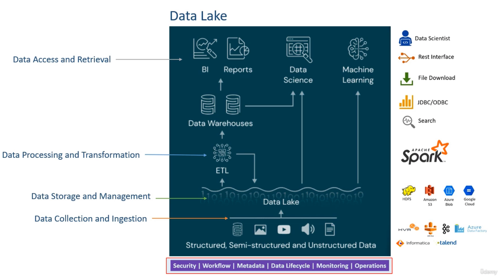
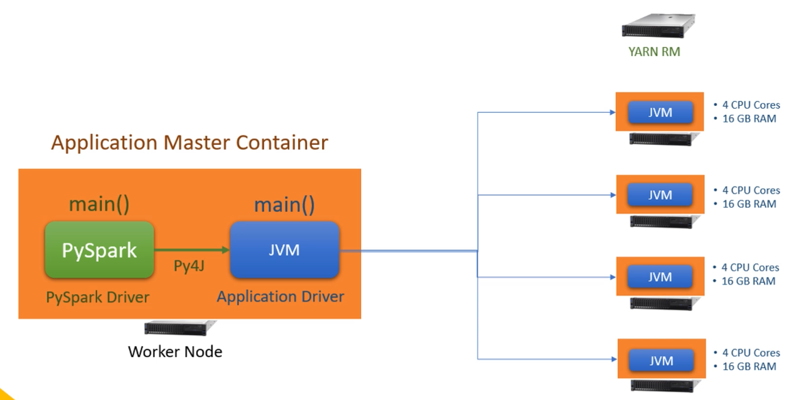
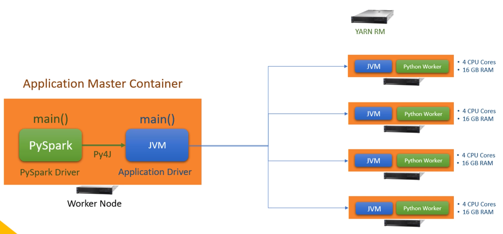
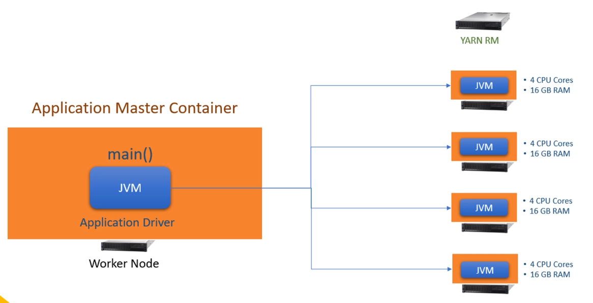

# Spark Programming

## Big Data Systems

* Hadoop: running a distributed cluster as a single machine needs 3 key pieces
  * YARN: cluster operatiing system (orchastrate AM containers at work nodes for different apps, manage nodes, resources, app and master)
  * HDFS: Distributed storage (split files into blocks 128MB, distribute to different nodes, maintain file metadata: filename, size, blocks etc)
  * Map/Reduce: Distributed Computing programming model and framework
    * Map function run at each node, reduce function aggregate all nodes
* Hive is a popular application of Hadoop in the past
* Apache Spark + Databricks inherit hadoop model and improved every aspects of hadoop and work in cloud env
  * Data Lake (old)
  * Lakehouse - On Cloud (new)
  * Spark does not come with cluster management system, it uses YARN, Kubernetes, Mesos as the cluster manager system. 
  * Spark also does not come with a storage management system, it uses HDFS, S3, Azure Blob, GCS, CFS etc.
  * Spark Compute Engine interact with the cluster and storage management system to manage data processing jobs



## Spark Execution Model and Architecture

* Execution model
  * Client: Interactive client (spark shell, notebook)
    * Client Machine for interactive mode (not for long running jobs)
  * Cluster: Submit job (spark-submit, databrick notebook, rest api)
* Cluster Manager 
  * **local[n]**: n = 1, driver only, n = 3, 1 driver and 2 executor (defined in `spark.conf`)
  * **YARN** (On-Premise, On-Cloud)
  * Kubernetes
  * Mesos
  * Standalone
  * Distributed processing model
    * Driver 1 => Excecutors, Driver 2 => Executors
    
## Using Spark

* local setup:
  * Need to download and `export $SPARK_HOME=downloaded_sparkpath`
  * Need to use java8 or 11 so use `export JAVA_HOME=/usr/local/Cellar/openjdk@11/11.0.16`
  * `export PATH=$PATH:$SPARK_HOME/bin` to enable spark-shell command
  * `export PYSPARK_PYTHON=python3` to enable pyspark shell
* GCP Dataproc cluster is a Yarn cluster (AWS EMR)
* `spark history server` show executions in the past
* `spark context UI` show event timeline
* `spark-submit --master yarn --deploy-mode cluster myfile.py 100` one can run spark-summit in spark shell

### Spark logging

* Create a log4j configuration file: create a `log4j.properties` to define how we will log information for spark apps, it allows us to collect logs from distributed executors and append together
* Configure spark JVM to pickup the log4J configuration file: Add to `spark-default.conf` with `spark.driver.extraJavaOptions` with `-Dlog4j.configuration=file:log4j.properties -Dspark.yarn.app.container.log.dir=app-logs -Dlogfile.name=myproject`
* Create a Python Class to get Spark's Log4J instance and use it

### Spark Session
* Spark session is the driver for an spark app. When we start a spark shell or databrick notebook, it will create a spark session behind the scene call `spark`


## Spark Data Frame

Read => Process => Write

### Read files

* Dataframe must have column name and their datatype

  ```python
  df = spark.read \
            .option("header", "true") \
            .option("inferSchema", "true") \
            .csv(filename)
  ```

### Partition and Executors

* Dataframe store in partition of HDFS
  * Driver create logical In-Memory partition and orchastrate cluster manager (e.g. Yarn) to assign executors
  * Executors is assigned with partitions to work on
* Spark dataframe is immutable
  * driver perform transformations, user intermediate variable to store outcome of transformation

  ```python
    filtered_df = df \
      .where("age < 40") \
      .select("age", "gender", "country", "state")
    grouped_df = filtered_df.groupBy("Country")
    count_df = grouped_df.count()
    ```

* spark data operations is a dag of operations
  * transformations (repartition)
    * narrow dependency: can perform on each partition (e.g. where)
    * wide dependency: require data from other partition (e.g. groupBy, join, orderBy, distinct) => shuffle/sort exchange
  * actions (e.g. read, write, collect, show)
  * Lazy evaluation: when we create a dag of spark data operations, driver will optimize the dag, create an execution plan (may not be the same as our code sequence)
    * Transformation is lazy
    * Action is immediate
      * `show` is to print dataframe and mainly used for debugging
      * `Collect` action return the data frame as python list

## Spark Structured Data Processing API

* RDD APIs (raw, more flexible, but not optmized by Catalyst optimizer, not recommended to use)
  * Catalyst Optimizer
  * Dataset API (strongly tie to JVM thus with Scalar and Java)
  * DataFrame API (python driven)
  * Spark SQL (SQL driven)

* Spark RDD (Resilient Distributed Dataset) API
  * Fault tolarant (contain meta data on how to recreate partition)
  * Create RDD (need to use spark context)

    ```python
    SurveyRecord = namedtuple("SurveyRecord", ["Age", "Gender", "Country", "State"])
    sc = SparkContext(conf=conf)
    # or
    sc = spark.sparkContext
    linesRDD = sc.textFile(sys.argv[1])
    partitionedRDD = linesRDD.repartition(2)
    colsRDD = partitionedRDD.map(lambda line: line.replace('"', '').split(","))
    selectRDD = colsRDD.map(lambda cols: SurveyRecords(init(cols[1]), cols[2], cols[3], cols[4]))
    kv = filteredRDD.map(lambda r: (r.Country, 1))
    countRDD = kvRDD.reduceByKey(lambda v1, v2: v1 + v2)
    countRDD.collect()
    ```
  * Raw, more flexible, but not practical

* SparkSQL API
  * Register the dataframe to a view before perform spark SQL

  ```python
  surveyDF.createOrReplaceTempView("survey_tbl)
  countDF = spark.sql("select Country, count(1) as count from survey_tbl where Age<40 group by Country")
  countDF.show()
  ```
  
  * same performance as dataframe API

* Catalyst Optimizer (Spark SQL Engine)
  1. Analysis
  2. Logical optimization
  3. Physical planning
  4. Code generation
  

## Spark Data Sources and Sinks

* Data Source (Reading)
  * External (external to datalake)
    * JDBC data source (Oracle, SQL Server PostgresSQL)
    * NoSQL data source (Cassandra, MongoDB)
    * Cloud Data Warehouses (Snowflake, Redshift)
    * Stream Integrators (kafka, Kinesis)
    * 2 approaches:
      1. bring to lake first, then read => recommneded for batch data
      2. Use spark data source api directly connect to external source => recommended for streaming data

  * Internal
    * HDFS
    * AWS S3
    * Azure Blob
    * GCP
    * File format
      * CSV
      * JSON
      * Parquet
      * AVRO
      * Plain TEXT
      * Spark SQL Table
      * Delta Lake

* Data Sink (Write)
  * External (same as above)
  * Internal (same as above)

* Spark DataFrame Reader API

  ```python
  spark.read \
    .format("csv") \
    .option("header", "true") \
    .option("path", "path/data/") \
    .option("mode", "failfast") \
    .option("samplingRatio", "0.01) \ #if data size is large we can use this option to sample a small set first for test
    .schema(mySchema) \
    .load()
    
  #short cut
  spark.read.csv(path).option(...).schema(mySchema)
  ```

  * Read modes (`option("mode", "failfast")`)
    * permissive
    * dropmalformed (drop malformed data)
    * failfast (raise execption when encouter malformed data)
  * There are shortcut but recommend to use the standard form with `load()`
  
  * For csv file format, we can inferschema but it may not capture all schema right, use string as default
  * For json file format, schema is auto inferred but it may not capture all schema right, use string as default
  * parquet file has schema information build-in the data
  * Recommended to use parquet file format for spark data processing

* Spark DataFrame Schema
  * Datatype (spark type, scala types), we use spark type to define schema
  * spark schema
    * programmatically: StructType and StructField
    * SchemaDDL: `"""FL_Date Date, City STRING, count TIME"""`
  
* Spark DataFrame writer
  * settings
    * format: default is `parquet`
    * mode (saveMode: append, overwrite, errorifExists, ignore)
      * `overwrite` mode will also clean the dir before write to it
    * option
    * save
  * How to find number of parition of a dataframe?
    ```python
    # show number of partitions
    df.rdd.getNumPartitions()
    # show num of record per partition
    df.gropuby(spark_partition_id()).count().show()
    ```
  * control write partition
    * `.repartition(n)` (blindly)
    * `.partitionBy(co1, co2, ...)` break logically
    * `.bucketBy(n, col1, col2)` based on file
    * `sortBy()`
    * `maxRecordsPerFile` control the filesize based on record number
  * random equal partition (use `.repartition(n)`) may not be the optimal solution, it enables the parallel processing but it does not take advantage of partition elimination. break logically with `.partitionBy(col...)` often is more optimal
  * use `option("maxRecordsPerFile", 10000)` to cap file size
  
  * To enable spark to read and write avro file format we need to enable jar in `spark-default.conf`
    ```
    spark.jars.packages org.apache.spark:spark-avro_2.11:2.4.5
    ```

* Spark databases and tables
  * Tables: has both table data and table metadata (catalog metastore)
    * Managed tables: 1. create table, save its metadata, 2. save table to a predefined warehouse directory location (which cannot change at the runtime)
    * unmanaged tables (external tables): 1. creat table, save its metadata (need to define data physical location)
  * Views: only has metadata (catalog metastore)
  * To create managed table

    ```python
    spark = SparkSession \
      .builder \
      .master("local[3]") \
      .appName("myapp") \
      # To enable hive support
      .enableHiveSupport() \ 
      .getOrCreat()
    
    # define database name
    spark.catalog.setCurrentDatabase("DatabaseName")
    
    df.write \
      .mode("overwrite") \
      #.partitionBy("col1", "col2") \ # do not partition with col has too many unique values
      #bucketBy is better since we have control on # of partition
      .bucketBy(5, "col1", "col2") \ 
      .sortBy("col1", "col2")
      .saveAsTable("mytable")
     #.saveAsTable("DatabaseName.mytable") if database name is note defined above 
    ```

## Spark Dataframe and Dataset Transformation

* Spark represent data source with 2 interfaces
  * Data Frame (programatic)
  * Data table (SQL)
  * Transformation can also perform based on 2 interfaces
* Working with Row
  * Manually creating Rows and Dataframe
  
    ```python
    # create sample data
    my_schema = StructType([
      StructField("ID", StringType())
      StructField("EventDate", StringType())
    ])
    
    my_rows = [Row("123", "01/01/2022"), 
               Row("124", "02/01/2022")
               Row("125", "02/15/2022")
               Row("126", "03/05/2022")]
    my_rdd = spark.sparkContext.parallelize(my_rows, 2)
    my_df = spark.createDataFrame(my_rdd, my_schema)
    ```

  * work with individual row in spark transformation
  * Collecting Dataframe rows to driver
    * we cannot assert dataframe in unit test or pytest. We need to bring to driver use `collect()`
  
    ```python
    rows = df(...).collect()
    
    for row in rows:
      assert row['col'] == value
    ```

* Working with unstructured data
  * Leverage regex and string transformation
* Working with Columns (most of the cases)
  * column string
    `df.select("col", "col").show()`
  * column oboject
    `df.select(column("col1"), col("col2"), df.col3).show()`
  * string expression or SQL expressions
    `df.select(expr("to_date(concat(col1, col2), 'yymmdd')"))`
    or
    `df.selectExpr("Origin", "Dest", "Distance", "to_date(concat(Year,Month,DayofMonth),'yyyyMMdd') as FlightDate").show(10)`
  * column object expressions
    `df.select(to_date(concat("col1", "col2"), 'yymmdd').alias("new_col")).show()`
  * `withColumn(...)` allow to work on a single column without impact to other columns
* UDF function
  * udf function register a python function to spark driver so it can be serielized, send to and used in executors, need to define return type, default is `StringType()`
    * Register as dataframe udf, use for dataframe column object

      ```python
      from pyspark.sql.functions import *

      parse_string_udf = udf(parse_string, StringType())
      df.withColumn("parsed_my_col", parse_string_udf("my_col"))
      ```

    * Register as a SQL function to the catalog, use for sql expression

      ```python
      spark.udf.register("parse_string_udf", parse_string, StringType())
      survey_df3 = survey_df.withColumn("Gender", expr("parse_gender_udf(Gender)"))
      # create a list of functions registered for SQL function catalog
      catalog_udfs = [logger.info(r) for r in spark.catalog.listFunctions() if "parse_gender" in r.name]
      ```

## MISC Transformation Tips and Tricks

* Use a list of tuples (in addition to namedtuple) to quickly generate dataframe without column name, use `toDF()` function to quickly create column name without a schema predefined

  ```python
  data_list = [("Ravi", "28", "1", "2002"),
             ("Abdul", "23", "5", "81"), # 1981
             ("John", "12", "12", "6"), # 2006
             ("Rosy", "7", "8", "63"), # 1963
             ("Abdul", "23", "5", "81") # 1981
            ]
  raw_df = spark.createDataFrame(data_list).toDF("name", "day", "month", "year") 
  raw_df.printSchema()
  ```

* add a new id column with `monotonically_increaseing_id()` build-in function to generate monotoniclly increasing and unique

  ```python
  df1 = raw_df.withColumn("id", monotonically_increasing_id())
  ```

* use `case when` and `cast` (inline cast, change schema) expression

    ```python
    # inline cast
    df2 = df1.withColumn("year", expr("""
          case when year < 21 then cast(year as int) + 2000
          when year < 100 then cast(year as int) + 1900
          else year
          end"""))

    # change column schema
    df2 = df1.withColumn("year", expr("""
          case when year < 21 then year + 2000
          when year < 100 then year + 1900
          else year
          end""")cast(IntegerType()))

    # change column schema ahead of time
    df5 = df1.withColumn("day", col("day").cast(IntegerType())) \
          .withColumn("month", col("month").cast(IntegerType())) \
          .withColumn("year", col("year").cast(IntegerType())) 

    df6 = df5.withColumn("year", expr("""
              case when year < 21 then year + 2000
              when year < 100 then year + 1900
              else year
              end"""))
    ```

* Column change with `when` an alternative to `case when`

    ```python
    df7 = df5.withColumn("year", \
                      when(col("year") < 21, col("year") + 2000) \
                      .when(col("year") < 100, col("year") + 1900) \
                      .otherwise(col("year")))
    ```

* drop column with `drop`, drop duplicate `dropDuplicates`, `sort`

    ```python
    df9 = df7.withColumn("dob", to_date(expr("concat(day,'/',month,'/',year)"), 'd/M/y')) \
         .drop("day", "month", "year") \
         .dropDuplicates(["name", "dob"]) \
         .sort(expr("dob desc"))
    ```

## Aggregations

* aggregation functions
  * `avg()`
  * `count()`
  * `max()`
  * `min()`
  * `sum()`

    ```python
    invoice_df.select(f.count("*").alias("Count *"),
                      f.sum("Quantity").alias("TotalQuantity"),
                      f.avg("UnitPrice").alias("AvgPrice"),
                      f.countDistinct("InvoiceNo").alias("CountDistinct")
                      ).show()

    invoice_df.selectExpr(
          "count(1) as `count 1`",
          "count(StockCode) as `count field`",
          "sum(Quantity) as TotalQuantity",
          "avg(UnitPrice) as AvgPrice"
      ).show()

    invoice_df.createOrReplaceTempView("sales")
    summary_sql = spark.sql("""
            SELECT Country, InvoiceNo,
                  sum(Quantity) as TotalQuantity,
                  round(sum(Quantity*UnitPrice),2) as InvoiceValue
            FROM sales
            GROUP BY Country, InvoiceNo""")
    summary_sql.show()

    summary_df = invoice_df \
        .groupBy("Country", "InvoiceNo") \
        .agg(f.sum("Quantity").alias("TotalQuantity"),
              f.round(f.sum(f.expr("Quantity * UnitPrice")), 2).alias("InvoiceValue"),
              f.expr("round(sum(Quantity * UnitPrice),2) as InvoiceValueExpr")
              )

    # To make code more readable
    # Define variable for agg()   
    NumInvoices = f.countDistinct("InvoiceNo").alias("NumInvoices")
    TotalQuantity = f.sum("Quantity").alias("TotalQuantity")
    InvoiceValue = f.expr("round(sum(Quantity * UnitPrice),2) as InvoiceValue")

    exSummary_df = invoice_df \
          .withColumn("InvoiceDate", f.to_date(f.col("InvoiceDate"), "dd-MM-yyyy H.mm")) \
          .where("year(InvoiceDate) == 2010") \
          .withColumn("WeekNumber", f.weekofyear(f.col("InvoiceDate"))) \
          .groupBy("Country", "WeekNumber") \
          .agg(NumInvoices, TotalQuantity, InvoiceValue)
    ```
  
  Note: `count("*")` or `count(1)` will cound null values whereas `count(col)` will not count null values
* window functions
  * `lead()`
  * `lag()`
  * `rank()`
  * `dense_rank()`
  * `cume_dist()`

## Spark Join

* `left_df.join(right_df, join_expr, join_type)`
* To avoid ambigious column name error
  * rename cols:w
  * before join
  * drop ambigious cols after join
* optimize join because spark join it is expensive due to the distributed system, 2 common types
  * Shuffle join (unique join key determine how many executor can be leveraged for parallelizm)
  * Broadcast join (a small table to join a very large table)
    `join_df = df1.join(broadcast(df2, join_expr, "inner")`

-------
# Advanced Topics

## Spark Architecture

### Spark cluster and runtime architecture

* Spark is a distributied computing platform
* Spark appliction is a distributed application and needs a cluster
* Cluster tech for spark
  * Hadoop YARN
  * kubernetes
* A cluster has number of workders managed by e.g. YARN resource manager
  * A spart submit will send to YARN resource manager
  * It will start a application master container on a one worker node
* Python wrapper on top of java wrapper on top of spark core (scala)
  * my pyspark code will start a JVM
  * pyspark driver use py4j to call JVM (java wrapper) which runs scala code
  * i.e. pyspark driver use py4j to start JVM application driver
  * If written in scala, we will only have application driver
* Driver creates and start executors to perform data processing
* If you use other python libary outside of pyspark, it creates python workers at each excutor (i.e it needs a python runtime environment to execute python code)
* 3 types:
  * pyspark only
    
  * pyspark with other python library
    
  * scala
    

### Spark Submit

* Spark-summit is a command line tool to submit spark application to the cluster
* syntax

  ```bash
  spark-submit:
    --class (not applicaable for PySpark)
    --master <yarn, local[3]>
    --deploy-mode <client or cluster>
    --conf <e.g. spark.executorm.meoryOverhead=0.20>
    --driver-cores <2>
    --driver-memory <8G>
    --num-executors <4>
    --executor-cores <4>
    --executor-memory <16G>
  ```

### Spark deploy modes

* Cluster Mode: `spark-submit --master yarn  --deploy-mode cluter`
  * spark submit will ask YARN resource manager to run application from an AM container
  * spark driver is in the cluster


* Client Mode: `spark-submit --master yarn  --deploy-mode client`
  * spark application is a JVM application on user's machine
  * spark driver is on client machine
  * e.g. spark-shell, notebooks, interactive mode, debug


* We almost **always** use cluster mode because
  * No dependency on client machine
  * Better performance

### Spark Jobs - Stages, Shuffle, Task, Slots

* Spark dataframe API categories
  * Transformations
    * Narrow dependency
      * performed in parallel on data partitions independently
      * example: select(), filter(), withColumn(), drop()
    * Wide dependency
      * Performed after grouping data from multiple partitions
      * Example: groupBy(), join(), cube(), rollup() and agg(), repartition()
  * Actions:
    * Used to trigger some work (Job)
    * A `block` ends with an action
    * Example: read(), write(), collect(), take(), and count()

Note: `count()` on a plain dataframe is an action. All other places suc as `groupBy` dataframe or in agg method is a transformation

* Job plan

  * Spark will create a plan for each block of action
  * Spark will then break a plan into stages for each wide dependency transformation
  * Spark will execute each stage in order since we cannot execute them in parallele since the ouptut of one stage is the input for the next stage
    * output of a stage will be written into an exchange buffer (Write Example)
    * Input for the next stage is a Read exchange
    * To pass from one stage to next stage, spark perform `shuffle/sort` operation because the end of a stage is a wide dependency tranformation
  * Summary:
    1. spark create a job for each action which may contain series multiple transformations
    2. spark engine will optimize those transformation and create a logic plan for the job
    3. spark will break the plan into  multiple stages at the end of every wide dependnecy (if you don't have wide dependency transformation, it will be single stage plan)
    4. If you have n wide dependency, you will have n+1 stages
    5. data from one stage to next are shared using shuffle/sort operation
    6. each stage can have one or more parallel tasks, the number of tasks of the stages is equal to the number of input partitions
    7. **task** is the most important concept for a spark job which is the smallest unit of work in a spark job
    8. a task is send an executor to execute, an executor needs the task code and data parition to perform the task
    9. `Slots` (cpu thread) is the compute resources of executors for a task depending on the resource config
    10. task will send transformed data parition to driver, when driver collect all the successful tasks (if task failed, driver will perform retry) for performing the action

* Spark SQL consider each query as a spark job
  * both dataframe API and spark SQL api will use Spark SQL engine for logical plan

## Learning Reference:

* [Spark Programming](https://github.com/LearningJournal/Spark-Programming-In-Python.git)